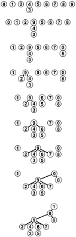

# Model and Code Documentation for V0

This is a computational model for evolution and speciation. Firt, the model is described, and following is the code. The order is not as it appear in the files, but as is used when compiling.

## Table of Contents
- [The model](#model)
	- [Overview](#Overview)
		- [Simplifications](#simplifications)
- [The code](#code)
	- [main.c](#main)
	- [Parameters](#parameters)
	- [Structures](#structure)
		- [The individual](#individual)
		- [The population](#population)
		- [The graph](#graph)
	- [Simulating](#simulation)
		- [Stablish_Distances](#stablish_distances)
		- [Reproduction](#reproduction)
		- [Count_Species](#count_species)
		- [Swap_Generations](#swap_generations)
- [Libraries](#libraries)
	- [functions.h](#functionsh)
		- [random_number](#random_number)
		- [rand_upto](#rand_upto)
		- [rand_1ton](#rand_1ton)
		- [Set_Parameters](#set_parameters)
		- [Alloc_Population](#alloc_population)
		- [Set_Initial_Values](#set_initial_values)
		- [Generate_Genome](#generate_genome)
		- [Verify_Distance](#verify_distance)
		- [Neighborhood](#neighborhood)
		- [Expand_Neighborhood](#expand_neighborhood)
		- [Shrink_Neighborhood](#shrink_neighborhood)
		- [Mutation](#mutation)
		- [Choose_Mate](#choose_mate)
		- [Create_Offspring](#create_offspring)
		- [Offspring_Position](#offspring_position)
	- [Randomness](#random)

## The model <a name="model"></a>
This is an evolutionary model. It is used to explore the mechanisms that allow speciation. 

When genetic flow between two populations stop, as the time passes, populations reproduce only within. They accumulate mutations until the point where the genetic pool is so far apart, no one in one population can reproduce with anyone from the other. The process of isolation occurs because of distance in space. 

Isolation could happen due to a barrier, like rivers, mountains or seas, or just due to distance. But could a population with genetic flow within give rise to new species? Theory says yes. That is simpatric speciation.

There are a lot of questions still waiting for an answer, that an evolutionary model can help. For example, how long does this process takes in different scenarios? Can two species become one again? Can speciation occurs without putting geographic barriers to stop genetic flow? How does the size of the genome affects the speciation? And many, many others.

### Overview <a name="overview"></a>

This model begins with a single species of hermafrodites, homogeneously distributed over a two-dimensional space, of genomically identical individuals. Reproduction is sexual. All individuals have the same chance of reproducing. Recombination and mutation are present when creating the offspring genome, adding genetic flow to the model. As the generations pass, the individuals accumulate differences, and speciation occurs when there is no possible genetic flow between two groups of individuals anymore.

It looks like this, initially:


### Simplifications <a name="simplifications"></a>
Any model needs simplifications and assumptions. The goal is to have simplifications that maintain the model meaningful. In the present work, simplifications are:

1. The genomes are a binary string
2. The generations don't overlap (mates come from the same generation)
3. There is no fitness. No one has advantages or disadvantages (it is a neutral model)
4. The population is stable, it doesn't grow or shrink much

	_This simplification could be considered as the space limit_

5. Two individuals can be in the same spot
6. The space is a toroid: the margins touch (see below)


## Code <a name="code"></a>
File structure is as follows

```bash
main.c
	model.h
		species.h
			genome.h
				structures.h
					time.h
					math.h
					linkedlist.h
					random.h
						gsl_randist.h 
						gsl_rng.h  
```
The `.h` files are included in `include/`, and the corresponding `.c` file is included in `source/`.

### Parameters <a name="parameters"></a>

To begin the simulation, we have to tell the program what we want it to simulate, so in the main file we create an structure called `Parameters`, and set the initial values we want to

```c
//in main
info = Set_Parameters();
```

This structure `Parametes`is used to easily pass the values between functions. The names of the parameters are very self-explanatory.

```c
//in structures.h
>>> parameters include/structures.h
```
These parameters can be manually set to the desired values. To make simulation and tests, we are using the following:

<a name="set_parameters"></a>
```c
//in model.c
>>> Set_Parameters source/model.c
```
First, the structure info is allocated dynamically, and then the values are set. It returns a "Parameters" structure. The hideous calculation for the neighborhood corresponds to an integer representing 60% of the average density of the system. In this case, the value is 2.

- `number_individuals`: system's carry capacity
- `population_size`: keeps the actual size of the focal population
- `individual_vector_size`: the size of the allocated population. It is bigger than the carry capacity so the population can double
- `reproductive_distance`: the maximum number of differences between two genomes of different individuals so they can reproduce
- `genome_size`: The size of their genetic code (fixed)
- `number_generations`: how long will the simulation last, in steps of time
- `lattice_length` and `lattice_width`: dimensions for the space
- `radius`: the distance an individual can look for mates
- `max_increase`: the maximum a radius can increase in the search for mates
- `dispersion`: the chance of the offspring dispersing
- `mutation`: the tax of genomic mutation
 
 The last values are less obvious, and are there because what we are modeling is spatial. Rho is the average density around an individual at t = 0. The parameter `density` keeps the number of how many individuals correspond to 60% of the density. To correct the `ceil` rounding, we subtract an epslon so the density is in a desired range.

 The parameter `max neighbors` keeps the minimum number of neighboors an individual need around it, so it won't be considered isolated.

### Structures <a name="structures"></a>

#### The individual <a name="individual"></a>

An individual has the following structure.

```c
//in structures.h
>>> individual include/structures.h
```
It has a binary genome, with the parameterized size, an indicatior to which species it belongs, it's coordinates in space and a list of possible mates those who are geneticaly compatible *and* inside it's range (the radius).

#### The population <a name="population"></a>
A population is just a vector of individuals.
```c
//in structures.h
>>> population include/structures.h
```
Inside the model, there are only two populations held in memory at a time. In the following code, we declare and allocate this structures.

```c
//in main
Population progenitors;
Population offspring;

>>> main_alloc main.c
```

A place is defined in the lattice for each individual in the beggining of the simulation.

<a name="set_initial_position"></a>

```c
//in space.c
>>> Set_Initial_Position source/space.c
```
This function receives a Population, a Parametes structure and fills the information of the genome, copying the same one to each individual. Then, it sorts a spot for this individual. 

#### The graph <a name="graph"></a>
It begins with one population with individuals, that have a genome, coordinates and a species (and it's list of compatible and spatial neighbors. At first, the individuals are identical, so **genetic flow** exists between all individuals. But further in time, the individuals accumulate diffences. In that case, genetic flow can be constructed as a **graph**, where the vertices corespond to individuals, and an edge exists between two vertices if the two individuals are genetically compatible (independently of geography), if they're compared.

Each vertix of the graph correpond to an individual. When two individuals are compared, if they are compatible, an edge between those individual is added. 


In the image, each set of dots of the same color compose a species. As soon as genetic flow is stablished between a red and a yellow individual, they become the same species.

In graph theory, a subgraph that is not connected to anyone else, is a _**maximal connected component**_, as are the collection of dots of the same color and their arcs in the image above. That is what we are going to call a **species**.

In the implementation of this concept, the graph is not created as a separate structure, but works in form of linked-lists through representatives. The algorithim used to work with the graph is the `Union-Find`, where, if two individuals are compatible, we perorm the `Union`, where one individual's representative is assigned to be the other. This constructs a tree, as shown below:



This structure is used to count the number of maximal connected components: the species.

```c
// in structures
>>> Union_Find source/structures.c
```
The algorithm is recursive, and it finds the representative of each class and unite classes if any pair of two given classes are compatible. It is the fastest way to find components of a graph.

### Simulating <a name="simulation"></a>
After initializing the values and creating our structure, the actual program can be written in a few lines:

```c
//in main
>>> main_loop main.c
```

The `for` loop will iterate in the generations. First, `Stablish_Distances` compare each individual with everyone in it's radius and starts connecting the population as a graph. Then, the progenitors will reproduce among themselves, and their children will be put in the "offspring" population vector. Then, `Count_Species()` will count how many species compose the progenitors population, and then swap the offspring and progenitors vectors, which can be interpreted as the progenitors dying and the offspring growing up to be progenitors. The parent's data is not stored at this point.

### Stablish_Distances <a name="stablish_distances"></a>

The function "Stablish_Distances" is redundant, and not at all at it's final state.

```c
//in species.c
>>> Stablish_Distances source/species.c
```
The function receives a Population and the Parameters. It compares each of the individuals in the population with it's neighbors, looking for differences in their genome. If two individuals are sufficiently similar, an arc will be inserted between their vertices. If not, there will be no arc between them (if there were, in the previous population, this arc will be removed). Durting this process, it creates the list of possible partners in their range.

The time it takes to run this function is O(n^2).

#### Subfunctions

##### Verify_Distance <a name="verify_distance"></a>

To find out if two individuals are in the range of one another should be simple, just comparing coordinates, right? WRONG! The space is toroid! So that is important to check out.

```c
//in space.c
>>> Verify_Distance source/space.c
```

This is a boolean function, it returns 1 if the individuals are in the range of one another, and 0 if they're not. It receives the names of the individuals to compare, the population and the parameters, and returns 0 or 1. Because the lattice is a toroid, it one individual could be in range of the other, but in the other side of the lattice, it needs to be checked. With a simple circle equation, we can, at the end, determine if one individual is in range of the other. The focal's coordinates are `x0` and `y0`, and the mate's are `x` and `y`.

##### Compare_Genomes <a name="compare_genomes"></a>

```c
//in genome.c
>>> Compare_Genomes source/genome.c
```

This is a boolean function, it returns 1 if the individuals are compatible, and 0 otherwise. It receives the names of the individuals to compare, the population and the parameters, and returns 0 or 1.

### Reproduction <a name="reproduction"></a>

Now that we know the relationship between all the progenitors (which species they are) and have the graph keeping it, they will reproduce, creating the offspring population. 

```c
//in model.c
>>> Reproduction source/model.c
```
The function for Reproduction receives two population vectors and the Parameters. For every individual, if the population is at carry capacity and the individual in question is in a low density region, it can reproduce twice. If one or both conditions are violated, it will have only one offspring with a probability of 63%. With 37% chance, it will not reproduce, giving a chance to another individual in it's neighborhood to reproduce. This could be interpreted as another individual using the resources spared by the focal's death, occuping it's niche.

The function "Find_Neighborhood" just returns the number of possible partners in its range an individual has, because it is a headed linked list, and the head keeps the size of the list.

The subtle balance of parameters, in this function, indicates who lives and dies in the model, shaping all of the other characteristics of the population as a whole. 

#### Subfunctions

##### Choose_Mate <a name="choose_mate"></a>

The function `Choose_Mate` sorts one of those neighbors out:
```c
//in space.c
>>> Choose_Mate source/space.c
```

Each individual has a linked list of compatible neighbors. This function just randomly chooses between one of them, and returns it. If the list is empty, then mate = -1. A similar function is this one:

<a name="sort_neighbor"></a>

```c
//in space.c
>>> Sort_Neighbor source/space.c
```

where this function is used to sort a neighbor in all the neighborhood, not just in the compatible one.

Another function that is necessary for 

```c
//in space.c
>>> Choose_Other source/space.c
```

This function chooses another individual around the focal to reproduce in its place. It looks twice for each increase in the radius, until it finds someone or increases the radius too much. It also looks one time more in the default radius.

Back to the reproduction, after choosing a mate, we ...

##### Create_Offspring <a name="create_offspring"></a>

```c
//in model.c 
>>> Create_Offspring source/model.c
```

This function defines the offspring's position and genome:

###### Offspring_Position <a name="offspring_position"></a>

```c
//in space.c
>>> Offspring_Position source/space.c
```

With 99% chance, the baby will be in the exact same spot as the focal parent. But it can move with 1% chance. If it moves, it sorts a radius `r` and an angle `theta`, so the whole area of the circle around the focal is covered. 

note: I don't know if sorting `theta` like this is the best option, if all the distribuitions are equally possible.

###### Offspring_Genome <a name="offspring_genome"></a>

```c
//in genome.c
>>> Offspring_Genome source/genome.c
```

The offspring gets each loci from any of its parents, with 50% chance from each.

After reproduction, we have two populations, the progenitors and the offspring.

### Count_Species <a name="count_species"></a>

To count how many species we have on the progenitors population, we will use the graph, and analise how many **maximal connected components** there are. For this, we use the algorithm `Union-Find`.

```c
//in species.c
>>> Count_Species source/species.c
```
It just calls the modified Depht-First Search

```c
//in structures.c
>>> Union_Find source/structures.c
```

This pair of functions uses recursion to find maximal connected components on this graph. It also assigns the "species" item to the progenitors.

### Swap_Generations <a name="swap_generations"></a>

After all this, our progenitors will die, because that's the circle of life. On the bright side, the offspring will become progenitors! Computationaly, creating all the structures again would be costy. We recicle the vectors, just swaping the populations pointers. All the content of "offspring" will be overwritten in the next iteration.

```c
//in structures.c
>>> Swap_Generations source/structures.c
```

Then, [repeat](#simulation).

After reproduction, we have two populations, the progenitors and the offspring.

### Finishing
After finnishing all the simulation, we need to free the stack.

```c
//in main
>>> main_free main.c
```
There has to be the same numbers of `alloc`s~ and `free`s, and finish the program.
```c
//in main
return 0;
```

## Final Considerations

If you are still reading, ~~congratulations~~ thank you very much! The text and the code are in construction, so email me any tips, errors or doubts at irina.lerner@usp.br or iri.lerner@gmail.com. You can also clone this file, commit your suggestions and create a pull request!

The following section is for documentation.

## Randomness <a name="random"></a>
To keep the model neutral, randomness is necessary. To do that, we are using the `C` random number generator, `rand()`, and `gsl_rng`, the random number generator of Gnu Scientific Library (Ref). Beggining from one specific value, `rand()` returns the same "random numbers" in the same order. So, to test the model, we can seed a fixed value. For multiple simulations, we use the time as seed for the function

```c
//in main
srand (time(&t));
GLOBAL_RNG = gsl_rng_alloc (gsl_rng_taus);
gsl_rng_set (GLOBAL_RNG, (int) time(NULL));
```
To keep the random numbers in a desired interval, the following functions can be used. They are in `source/random.c`

<a name="random_number"></a>

When a random number between 0 and 1, excluding both 0 and 1, is needed:

```c
>>> random_number source/random.c
```

<a name="rand_upto"></a>

To achieve an integer between 0 and a value, this function that generates an integer up to n cam be used.
```c
>>> rand_upto source/random.c
```

<a name="rand_1ton"></a>

To achieve an integer between 0 and a value, this function that generates an integer up to n cam be used.
```c
>>> rand_1ton source/random.c
```
