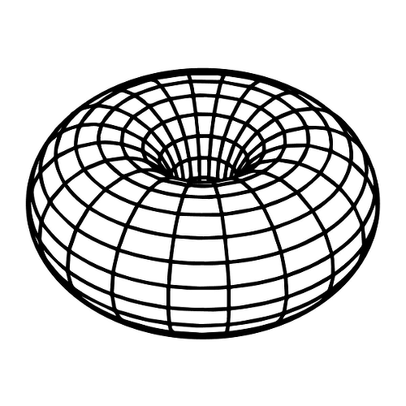

# Model and Code Walkthrough

#### Hello!

Welcome to my detailed walkthrough! If you are reading this, at this point, either you are my advisor or another person who knows me and the work (or some of the theory behind it); but all the possible readers have different backgrounds, and I want the text to be clear to anyone, and the code as self-explanatory as possible, so I'm making an informal text, with bits of theory.

My goal is the text to be complete, informative and helpfull on understanding the relation between what we **want** to model, and what we are **actually** modeling, because frankly, both you and me are here to help me fix some mistakes. So I'll be needing every little feedback you can give me, even if it's just a stylistic tip.

#### Let's begin!

This is a computational model for evolution and speciation. In this walkthrough, I am going to explain the model while showing the code correspondence at the same time, so it is also a documentation. If you have a specific doubt, you can look into the table of contents.

## Table of Contents
- [The model](#model)
	- [Overview](#Overview)
		- [Simplifications](#simplifications)
- [The code](#code)
	- [Randomness](#random)
	- [Parameters](#parameters)
	- [Structures](#structure)
		- [The individual](#individual)
		- [The population](#population)
		- [First Values](#alloc)
		- [The graph](#graph)
	- [Simulating](#simulation)
		- [Stablish_Distances](#stablish_distances)
		- [Reproduction](#reproduction)
		- [Count_Species](#count_species)
		- [Swap_Generations](#swap_generations)
- [Libraries](#libraries)
	- [functions.h](#functionsh)
		- [rand_upto](#rand_upto)
		- [random_number](#random_number)
		- [Set_Parameters](#set_parameters)
		- [Alloc_Population](#alloc_population)
		- [Set_Initial_Values](#set_initial_values)
		- [Generate_Genome](#generate_genome)
		- [Verify_Distance](#verify_distance)
		- [Neighborhood](#neighborhood)
		- [Expand_Neighborhood](#expand_neighborhood)
		- [Mutation](#mutation)
		- [Choose_Mate](#choose_mate)
		- [Create_Offspring](#create_offspring)
		- [Offspring_Position](#offspring_position)

## The model <a name="model"></a>

The goal is to model evolution, that is, how do many species arise from only one?

We know the answer. When the genetic flow between populations stop, as the time passes, those populations reproduce only within, they accumulate mutations until a point where the genetic pool is so far apart, no one from one population can reproduce with someone of the other.

But it doesn't mean there are no questions to be answered. For example, how long this process takes in different scenarios? Can two species become one again? Can speciation occurs without stopping the genetic flow? How does the size of the genome affects the speciation? And many, many others.

Modeling simplified evolution can give insights to those answers, but first we need our model to work as we think nature would, considering the parts we think are important in the long timescale, and removing the ones that we don't.

### Overview <a name="overview"></a>

Our model begins with a single species, homogeneously distributed over a two-dimensional space, of identical individuals (genomically). This species is composed by individuals, who reproduce sexually (it is the only thing they do). They leave their children to do the same, and die :( .

As the generations pass, the individuals accumulate differences, and speciation occurs when there is no possible genetic flow between two groups of individuals anymore.

It looks like this, initially:


_it is not very homogeneus, and maybe that is a problem_

### Simplifications <a name="simplifications"></a>
Any model needs simplifications and assumptions. The goal is to have simplifications that maintain the model meaningful.

Ours are those:

1. The genomes are binary

	_If we use four bases, the program would take a lot longer to process. But alternatively the genomes can be seen as if the 0 and 1 are indicators of absence or presence of a certain alele for a gene_

2. The individuals are hermaphrodites (not asexual, because they reproduce sexually)

	_There's not much "loss" here, as a lot of populations have hermaphrodites individuals who reproduce sexually. An example is the angiosperms plants_

3. The generations don't overlap (there are only couples from the same generation)

	_This is also not absurd to assume. Just consider the parents don't live enough to reproduce with the younger generation_

4. There is no fitness, no one has advantage or disadvantage (it is a neutral model)

 _This is not a simplification, but a view of biology. The Neutral Theory of Biodiversity states that the majority of the mutations that occur are not good of bad for the individual, but neutral. In larger timescales, that means fitness effects can be taken out of the equation_

5. The population is stable, it doesn't grow or shrink much

	_This simplification could be considered as the space limit_

7. Two individuals can be in the same spot
6. The space is a toroid, the margins touch. Like this



## Code <a name="code"></a>
The code is structured as this
```bash
main.c
	functions.h
		graph.h
		linkedlist.h
```

The "main" keeps the skeleton of the code, while the functions' library keep the stuffing. To make those stuffing parts, I built two libraries, one to work with graphs, and other one to use linked lists. They are included in functions.h.
```c
//in functions.h
#include <stdio.h>
#include <stdlib.h>
#include <time.h>
#include <math.h>
#include "graph.h"
#include "linkedlist.h"
#include <gsl_randist.h>
#include <gsl_rng.h>

//in main.c
#include "functions.h"
```
So that way, the libraries declared in functions.h can be used in main.c. I will not expose the full graph.h and linkedlist.h code here, but I tested them.

It is also necessary to initialize a global variable to use with the gsl library. It is the "state keeper" of the random number generator.

```c
//in functions.h
gsl_rng *GLOBAL_RNG;
```

 The main file will appear in order, so every code part beginning with "//main" in this file, is exactly in the same order as it appears in the main section. We cannot apply the same method for presenting the functions' library, because the same function can be used more than once. The most complicated parts of the functions library will be presented, and the rest is docummented in the last section.

To initialize the code, because c is a typed language, we need to declare the variables what we are using
```c
//in main.c
int main(){...
//...
	int i, j, l, number_species;
	Population progenitors, offspring;
	Graph G;
	Parameters info;
	unsigned int sample;

  GLOBAL_RNG = gsl_rng_alloc(gsl_rng_taus);
	...}
```
Those structures are explained in the sections bellow.

### Randomness <a name="random"></a>
To keep the model neutral, we need to use randomness to choose some values. To do that, we are using the c pseudo-random number generator, rand(). Beggining from one specific value, rand() returns the same "random numbers" in the same order. So, to test the model, we can seed a fixed value.(_Maybe it would be better using a more powerfull random number generator_)
```c
//in main
gsl_rng_set (GLOBAL_RNG, 1);
```
where 1 is the seed.

The functions I am currently using to produce random numbers are one based on rand(), or rand() itself. It generates a integer between 0 and RAND_MAX (the maximum value an integer can have).

<a name="rand_upto"></a>

To achieve an integer between 0 and a value, we can use this function that generates an integer up to n.
```c
int rand_upto (int n) 
{
	return (rand() / (RAND_MAX / (n + 1)));
}
```

<a name="random_number"></a>

When we need a random number between 0 and 1, excluding both 0 and 1, we use

```c
double random_number() 
{
	return((double) rand() / ((double) RAND_MAX + 1));
}
```

Just passing by to remember the functions are docummented in the last section.

### Parameters <a name="parameters"></a>
To begin the simulation, we have to tell the program what we want it to simulate, so in the main file we create an structure called Parameters, and set the initial values we want to
```c
//in main
info = Set_Parameters();
```

 This structure "Parametes" is used to easily pass the values between functions. The names of the parameters are very instructive.

```c
//in functions.h
typedef struct
	{
		int number_individuals;
		int individual_vector_size;
		int population_size;
		int genome_size;
		int reproductive_distance;
		int number_generations;
		int neighbors;
		double lattice_width;
		double lattice_lenght;
		double radius;
	} parameters;

	typedef parameters * Parameters;
```
These parameters can be manually set to the desired values. To make simulation and tests, we are using the following:

<a name="set_parameters"></a>
```c
//in functions.h
Parameters Set_Parameters ()
{
	Parameters info;

	info = (Parameters) malloc (sizeof (parameters));

	info->number_individuals     = 1000;
	info->population_size        = 1000;
	info->reproductive_distance  = 7;
	info->genome_size            = 150;
	info->number_generations     = 1000;
	info->lattice_lenght         = 100;
	info->lattice_width          = 100;
	info->radius                 = 5;
	info->individual_vector_size = (int)(info->number_individuals * 1.2);
	info->neighbors              = (int)(0.6*info->radius*info->radius*3.14159*info->number_individuals) / (info->lattice_lenght * info->lattice_width);

	return info;
}
```
First, the structure info is allocated dynamically, and then the values are set. It returns a "Parameters" structure. The hideous calculation for the neighborhood corresponds to an integer representing 60% of the average density of the system. In this case, the value is 2.

- **number_individuals**: system's carry capacity
- **population_size**: keeps the actual size of the focal population
- **individual_vector_size**: the size of the allocated population. It is bigger than the carry capacity so the population can double
- **reproductive_distance**: the maximum number of differences between two genomes of different individuals so they can reproduce
- **genome_size**: The size of their genetic code (fixed)
- **number_generations**: how long will the simulation last, in steps of time
- **lattice_lenght** and **lattice_width**: dimensions for the space
- **radius**: the distance an individual can look for mates

### Structures <a name="structures"></a>

#### The individual <a name="individual"></a>

An individual has the following structure.

```c
//in functions.h
typedef struct
{
	int* genome;
	int species;
	double x;
	double y;
	List neighborhood;
} individual;

typedef individual * Individual;
```
It has a binary genome, with the parameterized size, an indicatior of which species it belo//in functions.h
ngs, it's coordinates in space and a list of possible mates, those who are geneticaly compatible AND inside it's range (the radius).

#### The population <a name="population"></a>
A population is just a vector of individuals.
```c
//in functions.h
typedef Individual * Population;
```
Inside the model, there are only two populations at a time. In the following code, we declare and allocate this structures.

```c
//in main.c
Population progenitors;
Population offspring;

progenitors = Alloc_Population (info);
offspring = Alloc_Population (info);
```

#### Set first values<a name="alloc"></a>
Now we have the population vectors, with empty individuals structures in it. For each individual in the vector of the population we have to alloc their "internal structures" and set values to the generation 0, that is allocated as the first "progenitors"

<a name="set_initial_values"></a>
```c
//in functions.h
void Set_Initial_Values (Population progenitors, Parameters info)
{
	int i, j;
	int* first_genome;

	first_genome = Generate_Genome(info->genome_size);

	for (i = 0; i < info->individual_vector_size; i++) {
		for (j = 0; j < info->genome_size; j++) {
        	progenitors[i]->genome[j] = first_genome[j];
    	}
	}

	for (i = 0; i < info->number_individuals; i++) {
      progenitors[i]->x = random_number() * info->lattice_width;
      progenitors[i]->y = random_number() * info->lattice_lenght;
    }

    free (first_genome);
}
```
This function receives a Population, a Parametes structure and fills the information of the genome, copying the same one to each individual. Then, it sorts a spot for this individual. To generate this genome, we call the following function

<a name="generate_genome"></a>
```c
//in functions.h
int* Generate_Genome (int genome_size)
{
	int i;
	int* first_genome;

	first_genome = (int*) malloc (genome_size * sizeof(int));

	for (i = 0; i < genome_size; i++) {
		first_genome[i] = rand_upto(1);
	}
	return first_genome;
}
```
Generate_genome recieves a vector, and an integer corresponding to the vector's size. The genome is allocated. For each spot in the genome, it sorts a value between 0 and 1 with equal chance.

#### The graph <a name="graph"></a>
Now we have one population with individuals, that have a genome, coordinates and a species (and it's useful list of bootycalls). We know, at first, the individuals are identical, so we have **genetic flow** between all individuals. But further in time, the individuals accumulate diffences, and we have to find out the genetic flow of this population. How?

We construct a **graph**, where the dots corespond to individuals, and an arc exist between two dots if the two individuals are genetically compatible (independently of geography).

To make the correspondence between the graph and the individual, each dot has an index that is the same as the Population vector index of its corresponding individual.

As the generations pass, species connect and desconnect, as shown bellow (it can be seen forward or backward)


In the image, each set of dots of the same color compose a species. As soon as genetic flow is stablished between a red and a yellow individual, they become the same species.

In graph theory, a subgraph that is not connected to anyone else, is a _**maximal connected component**_, as are the collection of dots of the same color and their arcs in the image above. That is what we are going to call a **species**.

In the code, because of the included library graph.h, we can easily manipulate and set a graph for each population.

```c
//in main
G = CreateGraph (info->individual_vector_size, info->number_individuals);
```
The graph is dynamical, it is created once and modified along with the generations. To acomplish this, it's structure has three values
```c
//in graphs.h
typedef struct {
  int V;
  int U;
  int A;
  int (**adj);
} graph;

typedef graph * Graph;
```
**A** is the number of arcs in the graph, **V** is the total of vertices available, and **U** is the number of used vertices. This way, the population can vary without having to create and destroy new graphs (because I tried implementing different graphs for different generations and I failed). In the next generation, if the population grows or shrinks, the U parameter will change and the graph also grows or shrinks.

### Simulating <a name="simulation"></a>
After initializing the values and creating our structure, we are going to take a look at the ACTUAL program.
```c
//in main
for (number_species = 0, i = 0; i < info->number_generations; i++) {
      printf("GENERATION: %d\n", i);
      Stablish_Distances (G, progenitors, info);
	  Reproduction (G, progenitors, offspring, info);
      number_species = Count_Species (G, progenitors);
      Swap_Generations (&progenitors, &offspring);
      printf("NUMBER OF SPECIES = %d\n", number_species);
  	}
```
You may say "WOW, just that little? Just four functions?", but we still have at least 200 lines of code to explore! Now we have the intricate part of the model (giving me headaches).

The prints keep track of the stage of the simulation, so we can see how it is going, but they make the program slower.

The "for" commant turn each generation i in a step of time in which those four functions will run. First, "Stablish_Distances" fills de graph with the progenitors's genetical relations. Then, the progenitors will reproduce among themselves, and their children will be put in the "offspring" population vector. We count how many species compose the progenitors population, and then swap the offspring and progenitors vectors, wich
can be interpreted as the progenitors dying and the offspring growing up to have its own children.

### Stablish_Distances <a name="stablish_distances"></a>

The function "Stablish_Distances" is redundant, and not at all at it's final state.

```c
//in functions.h
void Stablish_Distances (Graph G, Population individuals, Parameters info)
{
	int i, j, k, divergences, size_difference;

	G->U = info->population_size;

	for (i = 0; i < G->U; i++) {
		for (j = i + 1; j < G->U; j++) {
			divergences = 0;
			for (k = 0; k < info->genome_size; k++) {
				if (individuals[i]->genome[k] != individuals[j]->genome[k]) {
					divergences++;
				}
			}

			if (divergences <= info->reproductive_distance) {
				InsertArc (G, i, j, (info->genome_size - divergences));
			}
			else if (G->adj[i][j] != 0) {
				RemoveArc (G, i, j);
			}
		}
	}
	for (i = 0; i < G->U; i++) {
		RestartList (&individuals[i]->neighborhood);
		neighborhood (G, individuals, i, info, 0);
	}
}
```
The function receives a Graph G, a Population and the Parameters. It sets the number of needed vertices, setting G->U to the current population size. Then, it compares all the individuals in the population, looking for differences in their genome. If two individuals are sufficiently similar, an arc will be inserted between their vertices. If not, there will be no arc between them (if there were, in the previous population, this arc will be removed). Finally, it creates the list of possible partners in their range, freeing the previous list.

With this function, we have created a graph that contains comparative information between individuals, to be used further in the simulation.

_Even though this function is not perfect, It's there because it works, even if redundantly. We have bigger problems in the code, and optimizing this function comes after fixing those mistakes. The future plans for this part of the code is not to use a complete graph, because the only really important relations are the ones kept in the "neighborhood" list. To find out how many species can be used, we would implement an Union-Find algorithim, to find maximal connected components faster (explained further)._

#### Subfunctions

##### Neighborhood <a name="neighborhood"></a>

The neighborhood function used here is not part of the graph (yet). It needs a little more information to be created, that is, the distance from the focal individual. In this list, we keep only the individuals who are in the range of the focal (that is what I called a bootycall list).

```c
//in functions.h
void neighborhood (Graph G, Population progenitors, int focal, Parameters info, int increase)
{
	int mate;

	for (mate = 0; mate < (G->U); mate++) {
		if (G->adj[focal][mate] != 0 && Verify_Distance (progenitors, focal, mate, info, increase)){
			AddCellInOrder(&progenitors[focal]->neighborhood, mate);
		}
	}
}

```

The neighborhood function looks for everybody who is in the range of the focal, that is, everybody who is the same species as the focal and who is inside their range. Those mate-candidates are kept in a linked list (the ->neighborhood part of the struct).

**SUGESTION**
_A friend gave me a suggestion: first, to use a linked list graph, instead of a adjacency matrix one, and sort the linked lists by distance from the focal. It would affect the time taken to find out if two individuals are the same species (maybe that is not a problem, because they have a "->species" identifier), but it would simplify this function. What do you think? Let me know!_

##### Verify_Distance <a name="verify_distance"></a>

To find out if two individuals are in the range of one another should be simple, just comparing coordinates, right? WRONG! The space is toroid! So that is important to check out.

```c
//in functions.h
int Verify_Distance (Population progenitors, int focal, int mate, Parameters info, int increase)
{
	double x, x0, y, y0, r;
	
	r = info->radius + increase;

	x0 = progenitors[focal]->x;
	y0 = progenitors[focal]->y;
	x = progenitors[mate]->x;
	y = progenitors[mate]->y;

	if (y0 >= info->lattice_lenght - r && y <= r)
		y = y + info->lattice_lenght;

	if (y0 <= r && y >= info->lattice_lenght - r)
		y = y - info->lattice_lenght;

	if (x0 >= info->lattice_width - r && x <= r)
		x = x + info->lattice_width;

	if (x0 <= r && x >= info->lattice_width - r)
		x = x - info->lattice_lenght;

	if ((x - x0) * (x - x0) + (y - y0) * (y - y0) <= r * r)
		return 1;
	else 
		return 0;
}
```

This is a boolean function, it returns 1 if the individuals are in the range of one another, and 0 if they're not. It receives the names of the individuals to compare, the population and the parameters, and returns 0 or 1. Because the lattice is a toroid, it one individual could be in range of the other, but in the other side of the lattice, it needs to be checked. With a simple circle equation, we can, at the end, determine if one individual is in range of the other. The focal's coordinates are `x0` and `y0`, and the mate's are `x` and `y`.

### Reproduction <a name="reproduction"></a>

Now that we know the relationship between all the progenitors (which species they are) and have the graph keeping it, they will reproduce, creating the offspring population. 

```c
void Reproduction (Graph G, Population progenitors, Population offspring, Parameters info)
{ 	
	int focal, mate, other, baby, n;

	baby = 0;

	if (info->population_size < info->number_individuals) {
		for (focal = 0; focal < info->population_size; focal++) {
			if (Verify_Neighborhood (progenitors[focal]->neighborhood) < info->neighbors) {
				mate = Choose_Mate (G, focal, progenitors, info);
				if (mate != -1) {
					Create_Offspring (progenitors, offspring, baby, focal, focal, mate, info);
					baby++;
					info->population_size ++;
				}
			}
		}
	}

	for (focal = 0; focal < (G->U); focal++) {
		other = focal; 
		mate = -1;

		if (random_number() < 0.63 && Verify_Neighborhood (progenitors[focal]->neighborhood) > 2) {
			mate = Choose_Mate (G, focal, progenitors, info);
		}

		for (n = 0; n < 2; n++) {
			if (mate == -1) {
				other = Choose_Mate (G, focal, progenitors, info);
				if (other != -1)
					mate = Choose_Mate(G, other, progenitors, info);
			}
		}

		if (mate != -1 && other != -1) {
			Create_Offspring (progenitors, offspring, baby, focal, other, mate, info);
			baby++;
		}
		else {
			info->population_size --;
		}
	}
	printf("pop size: %d\n", info->population_size);
}
```
The function for Reproduction receives two population vectors and the information about them, that is, the graph, and the Parameters. First of all, it verifies if the population is below its carry capacity. If yes, it gives a chance for individuals with low density to reproduce first. That can be biologicaly interpreted as if they have more food available, and so they can reproduce again. Then, for every individual in the population, it will have a chance at reproduction, with some chance of death. If they die, the "mate" variable will have value -1, and then the chance to reproduce will be given to some neighbor of the deceased. Twice. The offspring will only be created if we have both parents chosen.

The function "Verify_Neighborhood" just returns the number of possible partners in its range an individual has, because it is a headed linked list, and the head keeps the size of the list.

#### Subfunctions

##### Choose_Mate <a name="choose_mate"></a>

The function "Choose_Mate" sorts one of those neighbors out:
```c
//in functions.h
int Choose_Mate (Graph G, int focal, Population progenitors, Parameters info)
{
	int j, i, neighbors, expand, radius_increase, radius, mate;
	List p;
	List bigger_neighborhood;

	mate = -1;
	radius_increase = 0;

	bigger_neighborhood = CreateHeadedList ();

	while (radius_increase <= 3 && mate == -1) {
		if (radius_increase > 0) {
			expand_neighborhood (G, bigger_neighborhood, progenitors, focal, info, radius_increase);
		}

		neighbors = Verify_Neighborhood (progenitors[focal]->neighborhood);
		expand = Verify_Neighborhood (bigger_neighborhood);

		if (neighbors + expand) {
			i = rand_upto(neighbors + expand); //add 1?
			
			if (i <= neighbors) {
				for (j = 0, p = progenitors[focal]->neighborhood->next; p != NULL && j < i; p = p->next, j++);
			}
			else {
				i -= neighbors;
				for (j = 0, p = bigger_neighborhood->next; p != NULL && j < i; p = p->next, j++);	
			}

			if (j == i && p != NULL) {
				mate = p->info;
			} 
			else mate = -1;
		}

		else mate = -1;

		if (mate == -1) {
			radius += 1;
			radius_increase += 1;
		}
	}
	
	DestroyList (&bigger_neighborhood);
	
	return mate;
}
```

This function is long and it took me a while to figure it out. It receives the graph, the "name" of the focal individual that is looking for a mate, the population and the parameters. The focal first will look around him in his range, that is, in its "neighborhood" list, described in the previous section. If there are no neighbors in its range, it will look a little further: it expands it's range in 1 unit of space (reminder: the space is 100.000 square units of space). The extra neighbors are kept in another linked list, the "bigger_neighborhood" list. If there are still no possible partners, it will expand range again, and once more if necessary. Each time it expands neighborhood, the "bigger_neighborhood" list grows.

Once it has the list of possible partners, it sorts a number from 0 to the number of possible partners, and a walk through the list chooses who is THE ONE. To finnish, the "bigger_neighborhood" is destroyed. 

<a name="expand_neighborhood"></a>

The function "expand_neighborhood" looks like the function "neighborhood"

```c
//in functions.h
void expand_neighborhood (Graph G, List bigger_neighborhood, Population progenitors, int focal, Parameters info, int increase)
{
	int mate;

	for (mate = 0; mate < (G->U); mate++) {
		if (G->adj[focal][mate] != 0 && Verify_Distance (progenitors, focal, mate, info, increase)) {
			if (!Verify_Distance (progenitors, focal, mate, info, increase - 1)) {
				AddCellInOrder(&bigger_neighborhood, mate);
			}
		}
	}
}
```
But it only adds a possible mate to the list if it wasn't previously added. We only want to know if this individual is in the "added" space, so if it was in the previous considered space, it is not addded. We could also check if it was already on the list.

Back to the reproduction, after choosing a mate, we ...

##### Create_Offspring <a name="create_offspring"></a>

```c
//in functions.h
void Create_Offspring (Population progenitors, Population offspring, int baby, int focal, int other, int mate, Parameters info)
{
  int i;
	
	Offspring_Position(progenitors, offspring, baby, focal, info);

	for (i = 0; i < info->genome_size; i++) {
		if (progenitors[other]->genome[i] != progenitors[mate]->genome[i]) {
			if (rand_upto(1) == 1) {
				offspring[baby]->genome[i] = progenitors[mate]->genome[i];
			}
			else {
				offspring[baby]->genome[i] = progenitors[other]->genome[i];
			}
		}
		else {
			offspring[baby]->genome[i] = progenitors[mate]->genome[i];
		}
	}

	for (i = 0; i < info->genome_size; i++) {
		if (random_number() <= 0.00025) {
			mutation (offspring, baby, i);
		}
	}
}
```
This function recieves two populations, the progenitors and offspring, and the address (or name, whatever) to the focal, mate, and baby in the populations, and the parameters. It first decides where in the lattice the baby will be (again, reminder, it is a "paralel" lattice, the generations do not interact). Then, it fills out the structure of the new individual: the genome, choosing with 50/50 chance between the parents each loci, and then adding mutation. Each loci has 0,025% chance of being flipped (if its 1, it becomes 0, and vice versa). The rest of tge stucture will be filled with the graph.

The last function I need to present is how I choose the position of the offspring

##### Offspring_Position <a name="offspring_position"></a>

```c
//in functions.h
void Offspring_Position (Population progenitors, Population offspring, int baby, int focal, Parameters info)
{
	double movement_x, movement_y;
	double r, theta;

	movement_x = movement_y = 0;

	offspring[baby]->x = progenitors[focal]->x;
	offspring[baby]->y = progenitors[focal]->y;

	if (random_number() <= 0.01) {
		r = random_number() * info->radius;
		theta = rand_upto(360) + random_number();

		movement_y = sin(theta) * r;
		movement_x = cos(theta) * r;

		/* If an individual moves out of the lattice, it will reapear in the other side, because the lattice work as a toroid */
		if (offspring[baby]->x + movement_x <= info->lattice_width && progenitors[focal]->x + movement_x >= 0)
	  		offspring[baby]->x += movement_x;

		else if (progenitors[focal]->x + movement_x > info->lattice_width)
			offspring[baby]->x = offspring[baby]->x + movement_x - info->lattice_width;

		else if (progenitors[focal]->x + movement_x < 0)
			offspring[baby]->x = offspring[baby]->x + movement_x + info->lattice_width;

		if (progenitors[focal]->y + movement_y <= info->lattice_lenght && progenitors[focal]->y + movement_y >= 0)
	  	offspring[baby]->y = offspring[baby]->y + movement_y;

		else if (progenitors[focal]->y + movement_y > info->lattice_lenght)
			offspring[baby]->y = offspring[baby]->y + movement_y - info->lattice_lenght;

		else if (progenitors[focal]->y + movement_y < 0)
			offspring[baby]->y = offspring[baby]->y + movement_y + info->lattice_lenght;
	}
}
```
With 99% chance, the baby will be in the exact same spot as the focal parent. But it can move with 1% chance. If it moves, it sorts a radius `r` and an angle `theta`, so the whole area of the circle around the focal is covered. 

note: I don't know if sorting `theta` like this is the best option, if all the distribuitions are equally possible.

After reproduction, we have two populations, the progenitors and the offspring.

### Count_Species <a name="count_species"></a>

To count how many species we have on the progenitors population, we will use the graph, and analise how many **maximal connected components** there are. For this, we use **depth-first search**.

```c
//in functions.h
int Count_Species (Graph G, Population individuals)
{
	int counter;

	DepthFirstSearch (G, &counter, individuals);

	return counter;
}
```
It just calls the modified Depht-First Search

```c
//in functions.h
void DepthFirstSearch (Graph G, int* counter_adress, Population individuals)
{
  int i;
  int* parent;

  parent = (int*) malloc ((G->U) * sizeof (int));
  for (i = 0; i < (G->U); i++) {
    parent[i] = -1;
  }

  (*counter_adress) = 0;

  for (i = 0; i < (G->U); i++) {
    if (parent[i] == -1) {
      parent[i] = -2;
      individuals[i]->species = (*counter_adress);
      DSFvisit (G, i, parent, individuals, (*counter_adress));
      (*counter_adress)++;
    }
  }
  free (parent);
}

void DSFvisit (Graph G, Vertix v, int* parent, Population individuals, int species)
{
  int i;

  for (i = 0; i < (G->U); i++) {
    if (G->adj[v][i] != 0 && parent[i] == -1) {
      parent[i] = v;
      individuals[i]->species = species;
      DSFvisit (G, i, parent, individuals, species);
    }
  }
}
```

This pair of functions uses recursion to find maximal connected components on this graph. It also assigns the "species" item to the progenitors.

### Swap_Generations <a name="swap_generations"></a>

After all this, our progenitors will die, because that's the circle of life. On the bright side, the offspring will become progenitors! Computationaly, creating all the structures again would be costy. We recicle the vectors, just swaping the populations pointers. All the content of "offspring" will be overwritten in the next iteration.

```c
//in functions.h
void Swap_Generations (Population* progenitors_pointer, Population* offspring_pointer)
{
	Population helper;

	helper = (*progenitors_pointer);
	(*progenitors_pointer) = (*offspring_pointer);
	(*offspring_pointer) = helper;
}
```

Then, [repeat](#simulation).


### Finnishing
After finnishing all the simulation, we need to free the stack.
```c
//in main
DestroiGraph(G);
Free_Population (progenitors);
Free_Population (offspring);
free (info);
gsl_rng_free (GLOBAL_RNG);
```
There has to be the same numbers of alloc and free, and finnish the program.
```c
//in main
return 0;
```

## Final Considerations

If you are still reading, ~~congratulations~~ thank you very much! The text and the code are in construction, so email me any tips, errors or doubts at irina.lerner@usp.br or iri.lerner@gmail.com. You can also clone this file, commit your suggestions and create a pull request!

The following section is for documentation.

## Libraries <a name="libraries"></a>

### functions.h <a name="functionsh"></a>

<a name="alloc_population"></a>
The function Alloc_Population receives a Parameters structure and returns a Population. It generates space in memory for all the parts of each individual in the vector Population.

```c
Population Alloc_Population (Parameters info)
{
	Population individuals;
	int i, j;

	individuals  = (Population) malloc (info->individual_vector_size * sizeof (Individual));

	for (i = 0; i < info->individual_vector_size; i++) {
		individuals[i] = (Individual) malloc (sizeof (individual));
		individuals[i]->genome = (int*) malloc(info->genome_size * sizeof (int));
		individuals[i]->neighborhood = CreateHeadedList ();
	}

	return individuals;
}
```

<a name="verify_neighborhood"></a>

```c
int Verify_Neighborhood (List neighborhood)
{
	return (-(neighborhood->info + 1));
}
```
The head value of an empty list is -1. As the list grows, we subtract the number of items in the list. So if the list is empty, it returns 0, and if it has members, it returns the number of members. I've done it like this so I won't have to use another library for headed linked lists. It works because I'm adding to the list in order, and the only negative value (the head) will always appear first. 


<a name="mutation"></a>

```c
void mutation (Population offspring, int baby, int mutation)
{
	if (offspring[baby]->genome[mutation] == 1) {
		offspring[baby]->genome[mutation] = 0;
	}
	else {
		offspring[baby]->genome[mutation] = 1;
	}
}
```

This function flips the bit at the "mutation" spot in the genome of the baby.