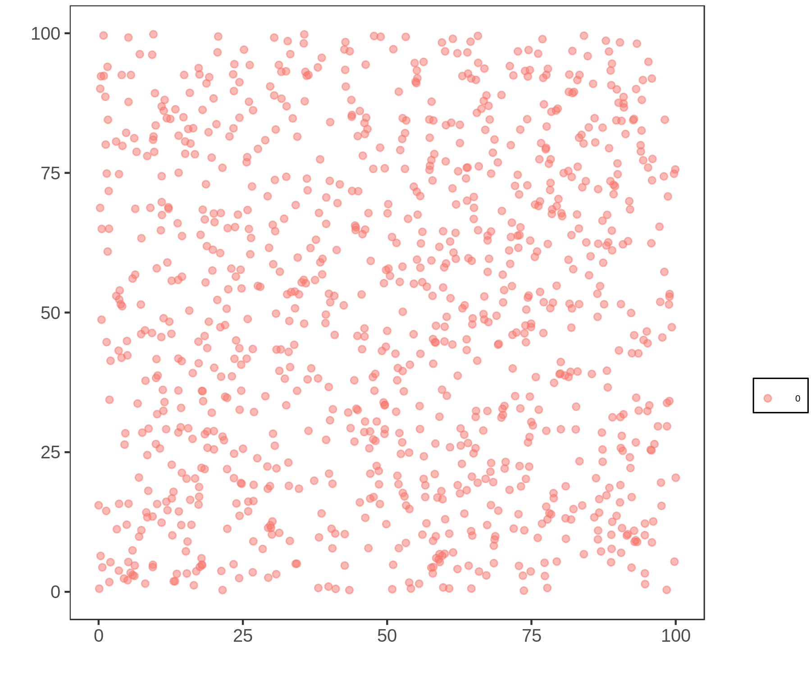

# Model and Code Walkthrough

#### Hello!

Welcome to my detailed walkthrough! If you are reading this, at this point, either you are my advisor or another person who knows {~~me and the work (or some of the theory behind it)~>the research and me~~}; {~~but~>however,~~} {~~all the possible readers~>readers probably~~} have different backgrounds, and I want the text to be clear to {~~anyone~>everyone~~}, and the code {++to be ++}as self-explanatory as possible, so I'm making {~~an~>this~~} informal text, with bits of theory.

My goal is {~~the text~>for this document ~~} to be complete, informative and helpful{--l--} on understanding the relation between what we **want** to model, and what we are **actually** modeling, because frankly, both you and {~~me~>I~~} are here to help me fix some mistakes. So I'll be needing every little feedback you can give me, even if it's just a stylistic tip.

#### Let's begin!

This is a computational model for evolution and speciation. In this walkthrough, I am going to explain the model while showing the code {~~correspondence~>that corresponds~~} at the same time, so it is also a documentation. If you have a specific doubt, you can look into function section through the table of contents, or in {++the ++}F.A.Q.

## Table of Contents
- [The model](#model)
	- [Overview](#Overview)
		- [Simplifications](#simplifications)
- [The code](#code)
	- [Randomness](#random)
	- [Parameters](#parameters)
	- [Structures](#structure)
		- [The individual](#individual)
		- [The population](#population)
		- [The graph](#graph)
	- [Simulating](#simulation)
		- [Stablish_Distances](#stablish_distances)
		- [Reproduction](#reproduction)
		- [Count_Species](#count_species)
		- [Swap_Generations](#swap_generations)
	- [Libraries](#libraries)
		- [rand_upto](#rand_upto)

## The model <a name="model"></a>
{~~The~>Our~~} goal is to model evolution{~~, t~>. T~~}hat is, how do many species arise from only one?

We know the answer. When the genetic flow between populations stop, as the time passes, those populations reproduce only within{~~, t~>. T~~}hey accumulate mutations until {~~a~>the~~} point where the genetic pool is so far apart{--,--} no one {~~from~>in~~} one population can reproduce with {~~someone of~>anyone from~~} the other.

But it doesn't mean there are no questions to be answered. For example, how long {++does ++}this process takes in different scenarios? Can two species become one again? Can speciation occurs without stopping the genetic flow? How does the size of the genome affects the speciation? And many, many others.

Modeling simplified evolution can {~~give~>provide~~} insights to those answers, but first we need our model to work as we think nature would, considering the parts we think are important in {~~the long~>evolutionary~~} timescale{++s++}{--, and removing the ones that we don't--}.

### Overview <a name="overview"></a>

Our model begins with a single species, homogeneously distributed over a two-dimensional space, of {~~identical individuals (genomically)~>genomically identical individuals~~}. {~~This species is composed by individuals, who reproduce sexually~>Reproduction is sexual~~}{-- (it is the only thing they do)--}. {~~They~>Individuals~~} leave {--their --}children {~~to do the same~>who will -- hopefuly -- reproduce~~}, and die :({-- --}.

As the generations pass, the individuals accumulate differences{~~, and s~>. S~~}peciation occurs when there is no possible genetic flow between two {~~individuals~>populations~~} anymore.

It looks like this, initially:
<center>



_it is not very homogeneus, and maybe that is a problem_
</center>

### Simplifications <a name="simplifications"></a>
Any model needs simplifications and assumptions. The goal is to have simplifications that maintain the model meaningful.

Ours are {~~those~>these~~}:

1. The genomes are {++a ++}binary{++ string++}
2. The individuals are hermaphrodites (not asexual, because they reproduce sexually)
3. The generations don't overlap ({~~there are only couples~>mates come~~} from the same generation)
4. There is no fitness{~~, n~>. N~~}o one has advantage{++s++} or disadvantage{++s++} (it is a neutral model)
5. The population is stable, it doesn't grow or shrink much
7. Two individuals can be in the same spot
6. The space is a toroid{~~, ~>: ~~}the margins touch{~~. L~> l~~}ike this

<center>


</center>

## Code <a name="code"></a>
The code is structured as {~~this~>follows~~}

```bash
main.c
	functions.h
		graph.h
		linkedlist.h
```

The {~~"main"~>`main` function~~} keeps the skeleton of the code, while the {~~functions'~>`functions`~~} library keep{++s++} the stuffing. To make {~~those stuffing parts~>that~~}, I built two libraries{~~,~>:~~} one to work with graphs, and {++an++}other one to {~~use~>word with~~} linked lists. They are included in {++`++}functions.h{++`++}.

```c
//in functions.h
#include <stdio.h>
#include <stdlib.h>
#include <time.h>
#include "graph.h"
#include "linkedlist.h"

//in main.c
#include "functions.h"
```

So that way, the libraries declared in {~~functions.h~>`functions.h`~~} can be used in {~~main.c~>`main.c`~~}. I will not expose the full {~~graph.h~>`graph.h`~~} and {~~linkedlist.h~>`linkedlist.h`~~} code here, {==but you can trust me it works, I tested it extensively==}{>>Acho melhor algo do tipo “for brevity, but you are welcome to look at the source”<<}.

The main file will appear in order, so every code part beginning with "//main" in this file, is exactly in the same order as it appears in the main section. We cannot apply the same method for presenting the functions' library, because the same function can be used more than once. The most complicated parts of the functions library will be presented, and the rest is docummented in the last section.
{>>Se você usar aquele programa que eu te passei, você consegue incluir o número das linhas (e potêncialmente a função de que vieram<<}
To initialize the code, because {~~c~>`C`~~} is a typed language, we need to declare the variables what we are using
{>>Esse tipo de comentário não acrescenta muita coisa. Todo mundo (que vai ler
isso) sabe que C tem tipos. O que você pode explicar é qual a sua inteção para
essas variáveis. Se isso não for relevante, você pode simplesmente dizer “deixo
as declarações para referência”<<}
```c
//in main.c
int main(){...}
//...
	int i, j, l, number_species;
	Population progenitors, offspring;
	Graph G;
	Parameters info;
	...
```
{==Those structures are explained in the sections bellow.==}{>>Seria melhor
apresentar *primeiro* o modelo do código (os tipos; como você representa as
componentes do problema em C) do que seu uso. Ou talvez logo em seguida, como
motivação.<<}

### Randomness <a name="random"></a>
To keep the model neutral, we need to use randomness to choose some values. To do that, we are using the {~~c~>`C`~~} random number generator, {~~rand()~>`rand()`~~}. Be{--g--}gining from one specific value, {~~rand()~>`rand()`~~} returns the same "random numbers" in the same order. So, to test the model, we can seed a fixed value.
{>>De novo, acho melhor elaborar mais sobre como aleatoriedade faz o modelo ser
neutro, e depois dizer “ah, btw a gente fixa a semente pra testar”<<}
```c
//in main, fixed seed
srand (1);
//other possibility, variable seed
srand (time (NULL));
```
The functions I am currently using to produce random numbers are one based on {~~rand()~>`rand()`~~}, or {~~rand()~>`rand()`~~} itself. It generates a integer between 0 and RAND_MAX (the maximum value an integer can have).

To achieve an integer between 0 and a value, we can use this function that generates an integer up to n.
```c
int rand_upto (int n)
	{
		return (rand() / (RAND_MAX / n + 1));
	}

```
{>>Acho que seria bom juntar essas “funções ajudantes” num apêndice<<}

When we need a random number between 0 and 1, we use

```c
//in functionsh
float random_number()
	{
		return((float)rand() / ((float)RAND_MAX + 1));
	}
```
Maybe it would be better to use a more powerful{--l--} random number generator.

### Parameters <a name="parameters"></a>
To begin the simulation, we have to tell the program what we want it to simulate, so in the main file we create an structure called {~~Parameters~>`Parameters`~~}, and set the initial values we want to
```c
//in main
info = Set_Parameters();
```

This structure {--"Parametes" --}is used to easily pass the values between functions. The names of the parameters are very {==instructive==}{>>“mnemonic”? “self-explanatory”?<<}.

```c
//in functions.h
typedef struct
	{
		int number_individuals;
		int individual_vector_size;
		int population_size;
		int genome_size;
		int reproductive_distance;
		int number_generations;
		int neighbors;
		float lattice_width;
		float lattice_lenght;
		float radius;
	} parameters;

	typedef parameters * Parameters;
```
These parameters can be manually set to the desired values. To make simulation and tests, we are using the following:

```c
//in functions.h
Parameters Set_Parameters ()
{
	Parameters info;

	info = (Parameters) malloc (sizeof (parameters));

	info->number_individuals     = 1000;
	info->population_size        = 1000;
	info->individual_vector_size = 1200;
	info->reproductive_distance  = 7;
	info->genome_size            = 150;
	info->number_generations     = 1000;
	info->lattice_lenght         = 100;
	info->lattice_width          = 100;
	info->radius                 = 5;
	info->neighbors              = 2;

	return info;
}
```
First, the structure is allocated dynamically, and then the values are set.
{>>Acho que não é necessário mencionar<<}

- {~~**number_individuals**~>`number_individuals`~~}: system's carry capacity
- {~~**population_size**~>`population_size`~~}: keeps the actual size of the focal population
- {~~**individual_vector_size**~>`individual_vector_size`~~}: the size of the allocated population. It is bigger than the carry capacity so the population can float
- {~~**reproductive_distance**~>`reproductive_distance`~~}: the maximum number of differences between two genomes of different individuals so they can reproduce
- {~~**genome_size**~>`genome_size`~~}: The size of their genetic code (fixed)
- {~~**number_generations**~>`number_generations`~~}: how long will the simulation last, in steps of time
- {~~**lattice_lenght** and **lattice_width**~>`lattice_lenght` and `lattice_width`~~}: dimensions for the space
- {~~**radius**~>`radius`~~}: the distance an individual can look for mates

### Structures <a name="structures"></a>

#### The individual <a name="individual"></a>

An individual has the following structure.

```c
//in functions.h
typedef struct
	{
		int* genome;
		int species;
		float x;
		float y;
		List neighborhood;
	} individual;

	typedef individual * Individual;
```
It has a binary genome, with the {==parameterized size==}{>>cadê isso?<<}, an indicatior {~~of~>to~~} which species it belongs, it's coordinates in space and a list of possible mates{~~,~> --~~} those who are geneticaly compatible {~~AND~>*and*~~} inside it{--'--}s range (the radius).

#### The population <a name="population"></a>
A population is just a vector of individuals.
```c
//in functions.h
	typedef Individual * Population;
```
Inside the model, there are only two populations {++held in memory ++}at a time. In the following code, we declare and allocate this structures.

```c
//in main.c
Population progenitors;
Population offspring;

progenitors = Alloc_Population (info);
offspring = Alloc_Population (info);
```

#### Allocate and Set first values<a name="alloc"></a>
Now we have the population vectors, with empty individuals structures in it. So we allocate the individuals, and set their initial values

```c
//in functions.h
Population Alloc_Population (Parameters info)
	{
		Population individuals;
		int i, j;

		individuals  = (Population) malloc (info->individual_vector_size * sizeof (Individual));

		for (i = 0; i < info->individual_vector_size; i++) {
			individuals[i] = (Individual) malloc (sizeof (individual));
			individuals[i]->genome = (int*) malloc(info->genome_size * sizeof (int));
			individuals[i]->neighborhood = CreateHeadedList ();
		}

		return individuals;
	}
```
For each individual in the vector of the population we have to alloc{++ate++} their {~~"internal structures"~>“internal structures”~~} and set values to the generation 0, that is allocated as the first {~~"progenitors"~>“progenitors”~~}
```c
	//in functions.h
	void Set_Initial_Values (Population progenitors, Parameters info)
	{
		int i, j;
		int* first_genome;

    	first_genome = Generate_Genome(info->genome_size);

    	for (i = 0; i < info->individual_vector_size; i++) {
    		for (j = 0; j < info->genome_size; j++) {
	        progenitors[i]->genome[j] = first_genome[j];
	    	}
    	}

    	for (i = 0; i < info->number_individuals; i++) {
	      progenitors[i]->x = random_number() * info->lattice_width;
	      progenitors[i]->y = random_number() * info->lattice_lenght;
	    }

	    free (first_genome);
	}
```
we generate the first genome with the following function:
```c
//in functions.h
void Generate_Genome (int* first_genome, int genome_size)
{
	int i;

	first_genome = (int*) malloc (genome_size * sizeof(int));

	for (i = 0; i < genome_size; i++) {
		first_genome[i] = rand_upto(1);
	}
}
```
For each spot in the genome, it {~~sorts~>draws~~} a value between 0 and 1 with equal chance.

#### The graph <a name="graph"></a>
Now we have one population with individuals{--,--} that have a genome, coordinates and a species (and it{--'--}s {~~useful~>helpful~~} list of {==bootycalls==}{>>yes, I approve this message<<}). We know, at first, the individuals are identical, so we have **genetic flow** between all individuals. But further in time{--,--} the individuals accumulate diffences, and we have to find out the {++possible ++}genetic flow {~~of~>in~~} this population. How?

We construct a **graph**, where the {~~dots~>vertices~~} corespond to individuals, and an {~~arc~>edge~~} exist{++s++} between two {~~dots~>vertices~~} if the two individuals are genetically compatible (independently of geography).

To make the correspondence between the graph and the individual, each {~~dot~>vertex~~} has an index that is the same as the {~~Population~>`Population`~~} vector{++'s++} index of its corresponding individual.

As the generations pass, species connect and d{~~e~>i~~}sconnect, as shown be{--l--}low (it can be seen forward or backward{++s++})

<center>


</center>

In the code, because of the included library {~~graph.h~>`graph.h`~~}, we can easily manipulate and set a graph for each population.

```c
G = CreateGraph (info->individual_vector_size, info->number_individuals);
```

In the image, each set of dots of the same color compose a species. As soon as genetic flow is stablished between a red and a yellow individual, they become the same species.

In graph theory, a subgraph that is not connected to anyone else{--,--} is a _**maximal connected component**_, as are the collection of dots of the same color and their arcs in the image above. That is what we are going to call a **species**.

### Simulating <a name="simulation"></a>
After initializing the values and creating our structure, we are going to take a look at the {~~ACTUAL~>*actual*~~} program.
```c
//in main
for (number_species = 0, i = 0; i < info->number_generations; i++) {
      printf("GENERATION: %d\n", i);
      Stablish_Distances (G, progenitors, info);
	  Reproduction (G, progenitors, offspring, info);
      number_species = Count_Species (G, progenitors);
      Swap_Generations (&progenitors, &offspring);
      printf("NUMBER OF SPECIES = %d\n", number_species);
  	}
```
You may say "{~~WOW~>*Wow*~~}, just that little? Just four functions?", but we still have at least 200 {++more ++}lines of code to explore! {~~Now we have~>We still have to look at~~} the {++more ++}intricate part of the model ({++which is ++}giving me headaches).

The prints keep track of the stage of the simulation, so we can see how it is going, {==but they make the program slower==}{>>Acho que precisar de *muitos* prints pra isso acontecer, mas se é o que você está vendo, deve ser o caso<<}.

The {~~"for"~>`for`~~} {~~commant~>loop~~} {==turn each generation i in a step of time in which those four functions will run==}{>>Ahn?<<}. First, {~~"Stablish_Distances"~>`Stablish_Distances`~~} fills {~~de~>the~~} graph with the progenitors's genetical relations. Then, the progenitors will reproduce among themselves, and their children will be put in the "offspring" population vector. We count how many species compose the progenitors population, and then swap the offspring and progenitors vectors, w{++h++}ich
can be interpreted as the progenitors dying and the offspring growing up to have its own children.

### Stablish_Distances <a name="stablish_distances"></a>


### Finnishing
After finnishing all the simulation, we need to free the stack.
{>>Não sei se precisa mencionar isso.<<} 
```c
//in main
DestroiGraph(G);
Free_Population (progenitors);
Free_Population (offspring);
free (info);
```
There has to be the same numbers of {~~alloc~>`*alloc`s~~} and {~~free~>`free`s~~}, and fin{--n--}ish the program.
{>>A *finnish* is a guy from Finland<<}
```c
//in main
return 0;
```

## Libraries <a name="libraries"></a>

### functions.h <a name="functions"></a>
<a name="rand_upto"></a>
```c
int rand_upto (int n)
	{
		return (rand() / (RAND_MAX / n + 1));
	}

```

When we need a random number between 0 and 1, we use

```c
//in functionsh
float random_number()
	{
		return((float)rand() / ((float)RAND_MAX + 1));
	}
```


### graph.h <a name="graph"></a>

### linkedlist.h <a name="linkedlist"></a>
