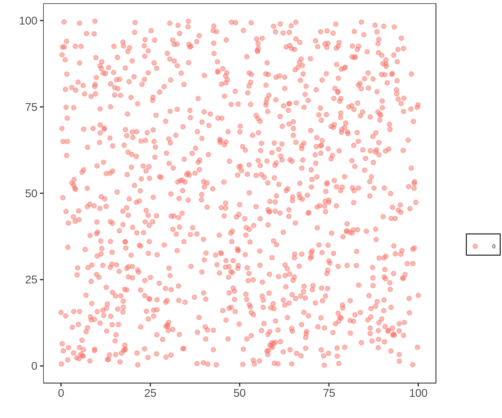
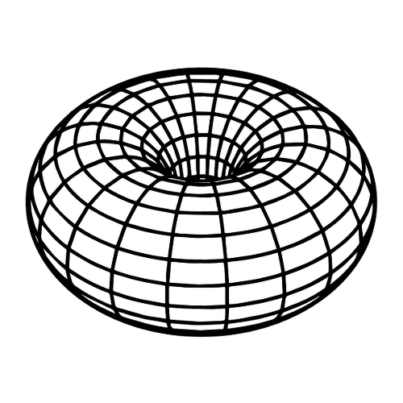

# Model and Code Documentation for V0

This is a computational model for evolution and speciation. Firt, the model is described, and following is the code. The order is not as it appear in the files, but as is used when compiling.

## Table of Contents
- [The model](#model)
	- [Overview](#Overview)
		- [Simplifications](#simplifications)
- [The code](#code)
	- [main.c](#main)
	- [Randomness](#random)
	- [Parameters](#parameters)
	- [Structures](#structure)
		- [The individual](#individual)
		- [The population](#population)
		- [First Values](#alloc)
		- [The graph](#graph)
	- [Simulating](#simulation)
		- [Stablish_Distances](#stablish_distances)
		- [Reproduction](#reproduction)
		- [Count_Species](#count_species)
		- [Swap_Generations](#swap_generations)
- [Libraries](#libraries)
	- [functions.h](#functionsh)
		- [random_number](#random_number)
		- [rand_upto](#rand_upto)
		- [rand_1ton](#rand_1ton)
		- [Set_Parameters](#set_parameters)
		- [Alloc_Population](#alloc_population)
		- [Set_Initial_Values](#set_initial_values)
		- [Generate_Genome](#generate_genome)
		- [Verify_Distance](#verify_distance)
		- [Neighborhood](#neighborhood)
		- [Expand_Neighborhood](#expand_neighborhood)
		- [Shrink_Neighborhood](#shrink_neighborhood)
		- [Mutation](#mutation)
		- [Choose_Mate](#choose_mate)
		- [Create_Offspring](#create_offspring)
		- [Offspring_Position](#offspring_position)

## The model <a name="model"></a>
This is an evolutionary model. It is used to explore the mechanisms that allow speciation. 

When genetic flow between two populations stop, as the time passes, populations reproduce only within. They accumulate mutations until the point where the genetic pool is so far apart, no one in one population can reproduce with anyone from the other. The process of isolation occurs because of distance in space. 

Isolation could happen due to a barrier, like rivers, mountains or seas, or just due to distance. But could a population with genetic flow within give rise to new species? Theory says yes. That is simpatric speciation.

There are a lot of questions still waiting for an answer, that an evolutionary model can help. For example, how long does this process takes in different scenarios? Can two species become one again? Can speciation occurs without putting geographic barriers to stop genetic flow? How does the size of the genome affects the speciation? And many, many others.

### Overview <a name="overview"></a>

This model begins with a single species of hermafrodites, homogeneously distributed over a two-dimensional space, of genomically identical individuals. Reproduction is sexual. All individuals have the same chance of reproducing. Recombination and mutation are present when creating the offspring genome, adding genetic flow to the model. As the generations pass, the individuals accumulate differences, and speciation occurs when there is no possible genetic flow between two groups of individuals anymore.

It looks like this, initially:



### Simplifications <a name="simplifications"></a>
Any model needs simplifications and assumptions. The goal is to have simplifications that maintain the model meaningful. In the present work, simplifications are:

1. The genomes are a binary string
2. The generations don't overlap (mates come from the same generation)
3. There is no fitness. No one has advantages or disadvantages (it is a neutral model)
4. The population is stable, it doesn't grow or shrink much

	_This simplification could be considered as the space limit_

5. Two individuals can be in the same spot
6. The space is a toroid: the margins touch (see below)



## Code <a name="code"></a>
File structure is as follows

```bash
main.c
	model.h
		species.h
			genome.h
				structures.h
					time.h
					math.h
					linkedlist.h
					random.h
						gsl_randist.h # for random distributions
						gsl_rng.h     # for random number generation
```
The `.h` files are included in `include/`, and the corresponding `.c` file is included in `source/`.

To begin understanding the code, three features must be explaned. The randomness, the parametrization and the structures.

### Randomness <a name="random"></a>
To keep the model neutral, randomness is necessary. To do that, we are using the `C` random number generator, `rand()`, and `gsl_rng`, the random number generator of Gnu Scientific Library (Ref). Beggining from one specific value, `rand()` returns the same "random numbers" in the same order. So, to test the model, we can seed a fixed value. For multiple simulations, we use the time as seed for the function

parei aqui

```c
//in main
srand (time(&t));
GLOBAL_RNG = gsl_rng_alloc (gsl_rng_taus);
gsl_rng_set (GLOBAL_RNG, (int) time(NULL));
```
To keep the random numbers in a desired interval, the following functions can be used.

<a name="random_number"></a>

When a random number between 0 and 1, excluding both 0 and 1, is needed:

```c
>>> random_number source/random.c
```

<a name="rand_upto"></a>

To achieve an integer between 0 and a value, this function that generates an integer up to n cam be used.
```c
int rand_upto (int n)
{
  return ((int) floor(random_number() * (n + 1)));
}
```

<a name="rand_1ton"></a>

To achieve an integer between 0 and a value, this function that generates an integer up to n cam be used.
```c
int rand_1ton (int n)
{
  return ((int) (random_number() * n) + 1);
}
```

### Parameters <a name="parameters"></a>

To begin the simulation, we have to tell the program what we want it to simulate, so in the main file we create an structure called `Parameters`, and set the initial values we want to

```c
//in main
info = Set_Parameters();
```

This structure `Parametes`is used to easily pass the values between functions. The names of the parameters are very self-explanatory.

```c
//in functions.h
typedef struct
{
	int number_individuals;
	int individual_vector_size;
	int population_size;
	int genome_size;
	int reproductive_distance;
	int number_generations;
	int density;
	int min_neighboors;
	int max_increase;
	int max_spot_density;
	double lattice_width;
	double lattice_length;
	double radius;
	double mutation;
	double dispersion;
} parameters;

typedef parameters * Parameters;
```
These parameters can be manually set to the desired values. To make simulation and tests, we are using the following:

<a name="set_parameters"></a>
```c
//in functions.h
Parameters Set_Parameters () 
{
	Parameters info;
	double rho, epslon = 0.74;

	info = (Parameters) malloc (sizeof (parameters));

	info->number_individuals     = 1000;
	info->population_size        = 1000;
	/* The population can grow and sink. Here we estimate the grown aoround 20% */
	info->individual_vector_size = (int)(info->number_individuals * 1.05);
	info->genome_size            = 150;
	info->reproductive_distance  = (int) floor(0.05*info->genome_size);
	info->number_generations     = 2000;
	info->lattice_length         = 100;
	info->lattice_width          = 100;
	info->radius                 = 5;
	info->mutation               = 0.00025;
	info->dispersion             = 0.01;
	info->min_neighboors         = 3;
	info->max_increase           = 2;
	info->max_spot_density       = 100;
	/* We need to know if the density around an individual is less than sufficient for reproduction, Here is the number os
	individuals that mark the density limit (60% of the original density) */
	rho = 0.83*((double) info->number_individuals)/((double) (info->lattice_length * info->lattice_width));
	info->density = (int) ceil(3.1416*rho*info->radius*info->radius * 0.6 - epslon);
	
	return info;
}
```
First, the structure info is allocated dynamically, and then the values are set. It returns a "Parameters" structure. The hideous calculation for the neighborhood corresponds to an integer representing 60% of the average density of the system. In this case, the value is 2.

- `number_individuals`: system's carry capacity
- `population_size`: keeps the actual size of the focal population
- `individual_vector_size`: the size of the allocated population. It is bigger than the carry capacity so the population can double
- `reproductive_distance`: the maximum number of differences between two genomes of different individuals so they can reproduce
- `genome_size`: The size of their genetic code (fixed)
- `number_generations`: how long will the simulation last, in steps of time
- `lattice_length` and `lattice_width`: dimensions for the space
- `radius`: the distance an individual can look for mates
- `max_increase`: the maximum a radius can increase in the search for mates
- `dispersion`: the chance of the offspring dispersing
- `mutation`: the tax of genomic mutation
 
 The last values are less obvious, and are there because what we are modeling is spatial. Rho is the average density around an individual at t = 0. The parameter `density` keeps the number of how many individuals correspond to 60% of the density. To correct the `ceil` rounding, we subtract an epslon so the density is in a desired range.

 The parameter `max neighbors` keeps the minimum number of neighboors an individual need around it, so it won't be considered isolated.

### Structures <a name="structures"></a>

#### The individual <a name="individual"></a>

An individual has the following structure.

```c
//in functions.h
typedef struct
{
	int* genome;
	int species;
	double x;
	double y;
	List compatible_neighbors;
	List spatial_neighbors;
} individual;

typedef individual * Individual;
```
It has a binary genome, with the parameterized size, an indicatior to which species it belongs, it's coordinates in space and a list of possible mates those who are geneticaly compatible *and* inside it's range (the radius).

#### The population <a name="population"></a>
A population is just a vector of individuals.
```c
//in functions.h
typedef Individual * Population;
```
Inside the model, there are only two populations held in memory at a time. In the following code, we declare and allocate this structures.

```c
//in main.c
Population progenitors;
Population offspring;

progenitors = Alloc_Population (info);
offspring = Alloc_Population (info);

Set_Initial_Values (progenitors, info);
```

#### Set first values<a name="alloc"></a>
Now we have the population vectors, with empty individuals structures in it. For each individual in the vector of the population we have to alloc their "internal structures" and set values to the generation 0, that is allocated as the first `progenitors`

For each individual in the vector of the population 0, the values of their characteristics need to be set. That is allocated as the first “progenitors”

<a name="set_initial_values"></a>

```c
//in functions.h
void Set_Initial_Values (Population progenitors, Parameters info)
{
	int i, j;
	int* first_genome;

	first_genome = Generate_Genome(info->genome_size);

	for (i = 0; i < info->individual_vector_size; i++) {
		for (j = 0; j < info->genome_size; j++) {
        	progenitors[i]->genome[j] = first_genome[j];
    	}
	}

	for (i = 0; i < info->number_individuals; i++) {
      progenitors[i]->x = random_number() * info->lattice_width;
      progenitors[i]->y = random_number() * info->lattice_length;
    }

    free (first_genome);
}
```
This function receives a Population, a Parametes structure and fills the information of the genome, copying the same one to each individual. Then, it sorts a spot for this individual. To generate this genome, we call the following function

<a name="generate_genome"></a>
```c
//in functions.h
int* Generate_Genome (int genome_size)
{
	int i;
	int* first_genome;

	first_genome = (int*) malloc (genome_size * sizeof(int));

	for (i = 0; i < genome_size; i++) {
		first_genome[i] = rand_upto(1);
	}
	return first_genome;
}
```
Generate_genome recieves a vector, and an integer corresponding to the vector's size. The genome is allocated.For each spot in the genome, it draws a value between 0 and 1 with equal chance.

#### The graph <a name="graph"></a>
It begins with one population with individuals, that have a genome, coordinates and a species (and it's list of compatible and spatial neighbors. At first, the individuals are identical, so **genetic flow** exists between all individuals. But further in time, the individuals accumulate diffences. In that case, genetic flow can be constructed as **graph**.

In this graph, the vertices corespond to individuals, and an edge exists between two vertices if the two individuals are genetically compatible (independently of geography).

To make the correspondence between the graph and the individual, each vertex has an index that is the same as the `Population` vector's index of its corresponding individual. As the generations pass, species connect and disconnect, as shown bellow (it can be seen forward or backwards)


In the image, each set of dots of the same color compose a species. As soon as genetic flow is stablished between a red and a yellow individual, they become the same species.

In graph theory, a subgraph that is not connected to anyone else, is a _**maximal connected component**_, as are the collection of dots of the same color and their arcs in the image above. That is what we are going to call a **species**.

In the code, because of the included library `graph.h`, we can easily manipulate and set a graph for each population.

```c
//in main
G = CreateGraph (info->individual_vector_size, info->number_individuals);
```

The graph is dynamical, it is created once and modified along with the generations. To acomplish this, it's structure has three values
```c
//in graphs.h
typedef struct {
  int V;
  int U;
  int A;
  int (**adj);
} graph;

typedef graph * Graph;
```
**A** is the number of arcs in the graph, **V** is the total of vertices available, and **U** is the number of used vertices. This way, the population can vary without having to create and destroy new graphs. In the next generation, if the population grows or shrinks, the U parameter will change and the graph also grows or shrinks.


### main.c

```c
//in functions.h
/* Libraries */
#include <time.h>
#include <math.h>
#include <gsl_randist.h>
#include <gsl_rng.h>
#include "graph.h"
#include "linkedlist.h"

//in main.c
#include "functions.h"
```
That way, the libraries declared in `functions.h` can be used in `main.c`. The full `graph.h` and `linkedlist.h` code will not be displayed here, for brevity, but you are welcome to look at the source.

It is also necessary to initialize a global variable to use with the gsl library. It is the "state keeper" of the random number generator.

```c
//in functions.h
gsl_rng *GLOBAL_RNG;
```

The main file will appear in order, so every code part beginning with `//main` in this file, is exactly in the same order as it appears in the main section. This order cannot be applied for presenting the functions' library, because the same function can be used more than once. The most complicated parts of the functions library will be presented, and the rest is docummented in the last section.

I will leave here the variables' declaration for reference.
```c
//in main.c
int main() {...
//...
	int i, j, k, l, number_species, type, deltat, p, count;
	int sizes[50];
	Population progenitors, offspring;
	Graph G;
	Parameters info;
	char nome_arq_s[80] = "";
	char nome_arq_p[80] = "";
	char nome_arq_st[80] = "";
	FILE *position;
	FILE *nspecies;
	FILE *size;
	FILE *stats;
	time_t t, ti, tf;
	clock_t start, end;
	double cpu_time_used_sim, total_cpu_time = 0;

	time(&ti);
	...}
```


### Simulating <a name="simulation"></a>
After initializing the values and creating our structure, the actual program can be written.

```c
//in main
for (i = 0; i <= info->number_generations; i++) {
    Stablish_Distances (G, progenitors, info);
	number_species = Count_Species (G, progenitors);
    Reproduction  (G, progenitors, offspring, info);
	printf(" %d \t %d \t  %d \t %d \t %d\n", l, i, number_species, G->U, info->density);
    Swap_Generations (&progenitors, &offspring);
  }
```

The `for` loop will iterate in the generations. First, `Stablish_Distances` fills the graph with the progenitors's genetical relations. Then, the progenitors will reproduce among themselves, and their children will be put in the "offspring" population vector. Then, `Count_Species()` will count how many species compose the progenitors population, and then swap the offspring and progenitors vectors, which can be interpreted as the progenitors dying and the offspring growing up to be progenitors. The parent's data is not stored at this point.

### Stablish_Distances <a name="stablish_distances"></a>

The function "Stablish_Distances" is redundant, and not at all at it's final state.

```c
//in functions.h
void Stablish_Distances (Graph G, Population individuals, Parameters info)
{
	int i, j, k, divergences;

	G->U = info->population_size;

	for (i = 0; i < G->U; i++) {
		for (j = i + 1; j < G->U; j++) {
			divergences = 0;
			for (k = 0; k < info->genome_size && divergences <= info->reproductive_distance + 1; k++) {
				if (individuals[i]->genome[k] != individuals[j]->genome[k]) {
					divergences++;
				}
			}

			if (divergences <= info->reproductive_distance) {
				InsertArc (G, i, j, divergences + 1);
			}
			else if (G->adj[i][j] != 0) {
				RemoveArc (G, i, j);
			}	
		}

		Neighborhood (G, individuals, i, info, 0);
	}
}
```
The function receives a Graph G, a Population and the Parameters. It sets the number of needed vertices, setting G->U to the current population size. Then, it compares all the individuals in the population, looking for differences in their genome. If two individuals are sufficiently similar, an arc will be inserted between their vertices. If not, there will be no arc between them (if there were, in the previous population, this arc will be removed). Finally, it creates the list of possible partners in their range, freeing the previous list.

With this function, we have created a graph that contains comparative information between individuals, to be used further in the simulation.

The time it takes to run this function is \Theta(n^2). Not because the construction of the graph, but because the construction of the neighborhoods.

#### Subfunctions

##### Neighborhood <a name="neighborhood"></a>

The neighborhood function used here is not part of the graph (yet). It needs a little more information to be created, that is, the distance from the focal individual. In this list, we keep only compatible individuals who are in the range of the focal.

```c
//in functions.h
void Neighborhood (Graph G, Population progenitors, int focal, Parameters info, int increase)
{
	int i;

	RestartList (&progenitors[focal]->compatible_neighbors);
	RestartList (&progenitors[focal]->spatial_neighbors);

	for (i = G->U - 1; i >= 0; i--) {
		if (focal != i) {
			if (Verify_Distance (progenitors, focal, i, info, increase)) {
				if (G->adj[focal][i] != 0) {
					AddCellInOrder(&progenitors[focal]->compatible_neighbors, i);
				}
				else {
					AddCellInOrder(&progenitors[focal]->spatial_neighbors, i);
				}
			}
		}	
	}
}
```

The neighborhood function looks for everybody who is in the range of the focal. The compatible neighbors will be put in the `->compatible_neighbors` list, and the not compatible will be put in the `->spatial_neighbors`

##### Verify_Distance <a name="verify_distance"></a>

To find out if two individuals are in the range of one another should be simple, just comparing coordinates, right? WRONG! The space is toroid! So that is important to check out.

```c
//in functions.h
int Verify_Distance (Population progenitors, int focal, int mate, Parameters info, int increase)
{
	double x, x0, y, y0, r;
	
	r = info->radius + increase;

	x0 = progenitors[focal]->x;
	y0 = progenitors[focal]->y;
	x = progenitors[mate]->x;
	y = progenitors[mate]->y;

	if (y0 >= info->lattice_length - r && y <= r)
		y = y + info->lattice_length;

	if (y0 <= r && y >= info->lattice_length - r)
		y = y - info->lattice_length;

	if (x0 >= info->lattice_width - r && x <= r)
		x = x + info->lattice_width;

	if (x0 <= r && x >= info->lattice_width - r)
		x = x - info->lattice_length;

	if ((x - x0) * (x - x0) + (y - y0) * (y - y0) <= r * r)
		return 1;
	else 
		return 0;
}
```

This is a boolean function, it returns 1 if the individuals are in the range of one another, and 0 if they're not. It receives the names of the individuals to compare, the population and the parameters, and returns 0 or 1. Because the lattice is a toroid, it one individual could be in range of the other, but in the other side of the lattice, it needs to be checked. With a simple circle equation, we can, at the end, determine if one individual is in range of the other. The focal's coordinates are `x0` and `y0`, and the mate's are `x` and `y`.

### Reproduction <a name="reproduction"></a>

Now that we know the relationship between all the progenitors (which species they are) and have the graph keeping it, they will reproduce, creating the offspring population. 

```c
void Reproduction (Graph G, Population progenitors, Population offspring, Parameters info)
{
	int focal, mate, other, baby, other_neighborhood, all_neighborhood, compatible_neighborhood, increase, n, occupation, expand, density;
	int changed[G->U];

	baby = 0;
	for (focal = 0; focal < (G->U); focal++) {
		mate = -1;
		compatible_neighborhood = Verify_Neighborhood (progenitors[focal]->compatible_neighbors);
		all_neighborhood = compatible_neighborhood + Verify_Neighborhood (progenitors[focal]->spatial_neighbors);
		if ((G->U) < info->number_individuals && all_neighborhood < info->density) {
			occupation = Site_Occupation (G, progenitors, focal, info);
			if (compatible_neighborhood >= info->min_neighboors && occupation < info->max_spot_density/3) {
				mate = Choose_Mate (G, focal, progenitors, info);
				for (n = 0; n < 2 && mate != -1; n++) {
					Create_Offspring (progenitors, offspring, baby, focal, focal, mate, info);
					baby ++;
				}
			}
		}
		else {
			for (increase = 0; all_neighborhood < 2 && increase < info->max_increase; increase++) {
				Expand_Neighborhood (G, progenitors, focal, info, increase + 1);
				compatible_neighborhood = Verify_Neighborhood (progenitors[focal]->compatible_neighbors);
				all_neighborhood = compatible_neighborhood + Verify_Neighborhood (progenitors[focal]->spatial_neighbors);
				changed[focal] = increase + 1;
			}
			if (all_neighborhood > 1) {
				other = Choose_Other (G, focal, progenitors, info, increase, changed);
				if (other != -1) other_neighborhood = Verify_Neighborhood (progenitors[other]->compatible_neighbors);
				else other_neighborhood = 0;
				if (other_neighborhood > 1) {
					mate = Choose_Mate (G, other, progenitors, info);
					if (mate != -1) {
						Create_Offspring (progenitors, offspring, baby, focal, other, mate, info);
						baby ++;
					}
				}
				if (other != focal && other != -1 && changed[other] > 0) {
					Shrink_Neighborhood (G, progenitors, other, info, changed[other]);
				}
			}
			if (changed[focal] > 0) {
				Shrink_Neighborhood (G, progenitors, focal, info, changed[focal]);
			}
		}
	}
	info->population_size = baby;
}
```
The function for Reproduction receives two population vectors and the information about them, that is, the graph, and the Parameters. For every individual, if the population is at carry capacity and the individual in question is in a low density region, it can reproduce twice. If one or both conditions are violated, it will have only one offspring with a probability of 63%. With 37% chance, it will not reproduce, giving a chance to another individual in it's neighborhood to reproduce. This could be interpreted as another individual using the resources spared by the focal's death, occuping it's niche.

The function "Verify_Neighborhood" just returns the number of possible partners in its range an individual has, because it is a headed linked list, and the head keeps the size of the list.

The subtle balance of parameters, in this function, indicates who lives and dies in the model, shaping all of the other characteristics of the population as a whole. 

#### Subfunctions

##### Choose_Mate <a name="choose_mate"></a>

The function `Choose_Mate` sorts one of those neighbors out:
```c
//in functions.h
int Choose_Mate (Graph G, int focal, Population progenitors, Parameters info)
{
	int j, i, neighbors, mate;
	List p;

	mate = -1;

	neighbors = Verify_Neighborhood (progenitors[focal]->compatible_neighbors);

	if (neighbors) {
		i = rand_1ton (neighbors);
		
		for (j = 1, p = progenitors[focal]->compatible_neighbors->next; p != NULL && j < i; p = p->next, j++);
		
		if (j == i && p != NULL) {
			mate = p->info;
		} 
		else mate = -1;
	}
	else mate = -1;

	return mate;
}
```

Each individual has a linked list of compatible neighbors. This function just randomly chooses between one of them, and returns it. If the list is empty, then mate = -1. A similar function is this one:

<a name="sort_neighbor"></a>

```c
//in functions.h
int Sort_Neighbor (Population progenitors, int i) 
{
	int j, k, compatible_neighbors, all, other;
	List p;

	if (i == -1) return -1;

	compatible_neighbors = Verify_Neighborhood (progenitors[i]->compatible_neighbors);
	all = compatible_neighbors + Verify_Neighborhood (progenitors[i]->spatial_neighbors);

	if (all) {
		k = rand_1ton (all);
		if (k <= compatible_neighbors)
			for (j = 1, p = progenitors[i]->compatible_neighbors->next; p != NULL && j < k; p = p->next, j++);
		else {
			k -= compatible_neighbors;
			for (j = 1, p = progenitors[i]->spatial_neighbors->next; p != NULL && j < k; p = p->next, j++);	
		}

		if (j == k && p != NULL) {
			other = p->info;
		}
		else other = -1;
	}
	else other = -1;

	return other;
}
```

where this function is used to sort a neighbor in all the neighborhood, not just in the compatible one.

Another function that is necessary for 

```c
//in functions.h
int Choose_Other (Graph G, int focal, Population progenitors, Parameters info, int increase, int changed[])
{
	int j, i, all, compatible_neighbors, radius_increase, other, n, focal_neighbors;
	List p;

	other = focal;
	radius_increase = 0;
	compatible_neighbors = all = 0;

	for (i = 0; i < G->U; ++i) {
		if (i != focal)
			changed[i] = 0;
	}

	focal_neighbors = Verify_Neighborhood (progenitors[focal]->compatible_neighbors);

	if (random_number() < 0.37 || focal_neighbors < info->min_neighboors) {
		other = Sort_Neighbor (progenitors, focal);
		compatible_neighbors = Verify_Neighborhood (progenitors[other]->compatible_neighbors);
		all = compatible_neighbors + Verify_Neighborhood(progenitors[other]->spatial_neighbors);
		if (other == -1) printf("ERRO");
		if (increase > 0) Shrink_Neighborhood (G, progenitors, focal, info, increase);
		n = 0;
		while (compatible_neighbors < info->min_neighboors && radius_increase < info->max_increase) {
			if (n > 1) {
				radius_increase ++;
				n = 0;
				other = focal;
				Expand_Neighborhood (G, progenitors, focal, info, radius_increase);
				changed[focal] = radius_increase;
			}
			other = Sort_Neighbor (progenitors, other);
			if (other != -1) {
				for (j = 0; j < radius_increase; j++) {
					Expand_Neighborhood (G, progenitors, other, info, j + 1);
        		}
				changed[other] = radius_increase;
				compatible_neighbors = Verify_Neighborhood (progenitors[other]->compatible_neighbors);
				all = compatible_neighbors + Verify_Neighborhood (progenitors[other]->spatial_neighbors);
			}
			n++;
    	}
	}

	for (i = 0; i < G->U; ++i) { /*diminuir apenas se for usar de novo*/
		if (changed[i] > 0 && i != focal && i != other) {
			Shrink_Neighborhood (G, progenitors, i, info, changed[i]);
 		}
	}

	return other;
}
```

This function chooses another individual around the focal to reproduce in its place. It looks twice for each increase in the radius, until it finds someone or increases the radius too much. It also looks one time more in the default radius.

<a name="expand_neighborhood"></a>

The function "expand_neighborhood" looks like the function "neighborhood"

```c
//in functions.h
void Expand_Neighborhood (Graph G, Population progenitors, int focal, Parameters info, int increase)
{
	int i;

	for (i = G->U - 1; i >= 0; i--) {
		if (focal != i) {
			if (Verify_Distance (progenitors, focal, i, info, increase - 1) == 0 && Verify_Distance (progenitors, focal, i, info, increase) == 1) {
				if (G->adj[focal][i] != 0) {
					AddCellInOrder(&progenitors[focal]->compatible_neighbors, i);
				}
				else {
					AddCellInOrder(&progenitors[focal]->spatial_neighbors, i);
				}
			}
		}	
	}
}
```
But it only adds a possible mate to the list if it wasn't previously added. We only want to know if this individual is in the "added" space, so if it was in the previous considered space, it is not addded. We could also check if it was already on the list.

After expanding neighborhood, we can shrink it back to zero.

<a name="shrink_neighborhood"></a>
```c
//In functions.h
void Shrink_Neighborhood (Graph G, Population progenitors, int focal, Parameters info, int increase)
{
	int i;

	if (increase > 0) {
		for (i = 0; i < G->U; i++) {
			if (focal != i) {
				if (Verify_Distance (progenitors, focal, i, info, 0) == 0 && Verify_Distance (progenitors, focal, i, info, increase) == 1) {
					if (G->adj[focal][i] != 0) {
						RemoveCell(&progenitors[focal]->compatible_neighbors, i);
					}
					else {
						RemoveCell(&progenitors[focal]->spatial_neighbors, i);
					}
				}
			}	
		}
	}
}
```

Back to the reproduction, after choosing a mate, we ...

##### Create_Offspring <a name="create_offspring"></a>

```c
//in functions.h
void Create_Offspring (Population progenitors, Population offspring, int baby, int focal, int other, int mate, Parameters info)
{
  int i;
	
	Offspring_Position(progenitors, offspring, baby, focal, info);

	for (i = 0; i < info->genome_size; i++) {
		if (progenitors[other]->genome[i] != progenitors[mate]->genome[i]) {
			if (rand_upto(1) == 1) {
				offspring[baby]->genome[i] = progenitors[mate]->genome[i];
			}
			else {
				offspring[baby]->genome[i] = progenitors[other]->genome[i];
			}
		}
		else {
			offspring[baby]->genome[i] = progenitors[mate]->genome[i];
		}
	}

	for (i = 0; i < info->genome_size; i++) {
		if (random_number() <= info->mutation) {
			mutation (offspring, baby, i);
		}
	}
}
```
This function recieves two populations, the progenitors and offspring, and the address (or name, whatever) to the focal, mate, and baby in the populations, and the parameters. It first decides where in the lattice the baby will be (again, reminder, it is a "paralel" lattice, the generations do not interact). Then, it fills out the structure of the new individual: the genome, choosing with 50/50 chance between the parents each loci, and then adding mutation. Each loci has 0,025% chance of being flipped (if its 1, it becomes 0, and vice versa). The rest of tge stucture will be filled with the graph.

The last function I need to present is how I choose the position of the offspring

##### Offspring_Position <a name="offspring_position"></a>

```c
//in functions.h
void Offspring_Position (Population progenitors, Population offspring, int baby, int focal, Parameters info)
{
	double movement_x, movement_y, r, theta;

	movement_x = movement_y = 0;

	offspring[baby]->x = progenitors[focal]->x;
	offspring[baby]->y = progenitors[focal]->y;

	if (random_number() <= info->dispersion) {
		r = random_number() * info->radius;
		theta = rand_upto(360) + random_number();

		movement_y = sin(theta) * r;
		movement_x = cos(theta) * r;

		/* If an individual moves out of the lattice, it will reapear in the other side, because the lattice work as a toroid */
		if (offspring[baby]->x + movement_x <= info->lattice_width && progenitors[focal]->x + movement_x >= 0)
	  		offspring[baby]->x += movement_x;

		else if (progenitors[focal]->x + movement_x > info->lattice_width)
			offspring[baby]->x = offspring[baby]->x + movement_x - info->lattice_width;

		else if (progenitors[focal]->x + movement_x < 0)
			offspring[baby]->x = offspring[baby]->x + movement_x + info->lattice_width;

		if (progenitors[focal]->y + movement_y <= info->lattice_length && progenitors[focal]->y + movement_y >= 0)
	 	 	offspring[baby]->y = offspring[baby]->y + movement_y;

		else if (progenitors[focal]->y + movement_y > info->lattice_length)
			offspring[baby]->y = offspring[baby]->y + movement_y - info->lattice_length;

		else if (progenitors[focal]->y + movement_y < 0)
			offspring[baby]->y = offspring[baby]->y + movement_y + info->lattice_length;
	}
}
```
With 99% chance, the baby will be in the exact same spot as the focal parent. But it can move with 1% chance. If it moves, it sorts a radius `r` and an angle `theta`, so the whole area of the circle around the focal is covered. 

note: I don't know if sorting `theta` like this is the best option, if all the distribuitions are equally possible.

After reproduction, we have two populations, the progenitors and the offspring.

### Count_Species <a name="count_species"></a>

To count how many species we have on the progenitors population, we will use the graph, and analise how many **maximal connected components** there are. For this, we use **depth-first search**.

```c
//in functions.h
int Count_Species (Graph G, Population individuals)
{
	int counter;

	DepthFirstSearch (G, &counter, individuals);

	return counter;
}
```
It just calls the modified Depht-First Search

```c
//in functions.h
void DepthFirstSearch (Graph G, int* counter_adress, Population individuals)
{
  int i;
  int* parent;

  parent = (int*) malloc ((G->U) * sizeof (int));
  for (i = 0; i < (G->U); i++) {
    parent[i] = -1;
  }

  (*counter_adress) = 0;

  for (i = 0; i < (G->U); i++) {
    if (parent[i] == -1) {
      parent[i] = -2;
      individuals[i]->species = (*counter_adress);
      DSFvisit (G, i, parent, individuals, (*counter_adress));
      (*counter_adress)++;
    }
  }
  free (parent);
}

void DSFvisit (Graph G, Vertix v, int* parent, Population individuals, int species)
{
  int i;

  for (i = 0; i < (G->U); i++) {
    if (G->adj[v][i] != 0 && parent[i] == -1) {
      parent[i] = v;
      individuals[i]->species = species;
      DSFvisit (G, i, parent, individuals, species);
    }
  }
}
```

This pair of functions uses recursion to find maximal connected components on this graph. It also assigns the "species" item to the progenitors.

### Swap_Generations <a name="swap_generations"></a>

After all this, our progenitors will die, because that's the circle of life. On the bright side, the offspring will become progenitors! Computationaly, creating all the structures again would be costy. We recicle the vectors, just swaping the populations pointers. All the content of "offspring" will be overwritten in the next iteration.

```c
//in functions.h
void Swap_Generations (Population* progenitors_pointer, Population* offspring_pointer)
{
	Population helper;

	helper = (*progenitors_pointer);
	(*progenitors_pointer) = (*offspring_pointer);
	(*offspring_pointer) = helper;
}
```

Then, [repeat](#simulation).


After reproduction, we have two populations, the progenitors and the offspring.

### Finishing
After finnishing all the simulation, we need to free the stack.

```c
//in main
DestroiGraph(G);
Free_Population (progenitors);
Free_Population (offspring);
free (info);
gsl_rng_free (GLOBAL_RNG);
```
There has to be the same numbers of `alloc`s~ and `free`s, and finish the program.
```c
//in main
return 0;
```

## Final Considerations
<<<<<<< HEAD

If you are still reading, ~~congratulations~~ thank you very much! The text and the code are in construction, so email me any tips, errors or doubts at irina.lerner@usp.br or iri.lerner@gmail.com. You can also clone this file, commit your suggestions and create a pull request!

The following section is for documentation.

## Libraries <a name="libraries"></a>

### functions.h <a name="functionsh"></a>

<a name="alloc_population"></a>
The function Alloc_Population receives a Parameters structure and returns a Population. It generates space in memory for all the parts of each individual in the vector Population.

```c
Population Alloc_Population (Parameters info)
{
	Population individuals;
	int i, j;

	individuals  = (Population) malloc (info->individual_vector_size * sizeof (Individual));

	for (i = 0; i < info->individual_vector_size; i++) {
		individuals[i] = (Individual) malloc (sizeof (individual));
		individuals[i]->genome = (int*) malloc(info->genome_size * sizeof (int));
		individuals[i]->neighborhood = CreateHeadedList ();
	}

	return individuals;
}
```

<a name="verify_neighborhood"></a>

```c
int Verify_Neighborhood (List neighborhood)
{
	return (-(neighborhood->info + 1));
}
```
The head value of an empty list is -1. As the list grows, we subtract the number of items in the list. So if the list is empty, it returns 0, and if it has members, it returns the number of members. I've done it like this so I won't have to use another library for headed linked lists. It works because I'm adding to the list in order, and the only negative value (the head) will always appear first. 


<a name="mutation"></a>

```c
void mutation (Population offspring, int baby, int mutation)
{
	if (offspring[baby]->genome[mutation] == 1) {
		offspring[baby]->genome[mutation] = 0;
	}
	else {
		offspring[baby]->genome[mutation] = 1;
	}
}
```

This function flips the bit at the "mutation" spot in the genome of the baby.