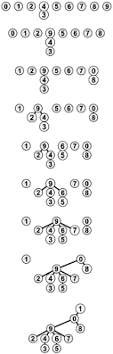

# Model and Code Documentation for V2

This is a computational model for evolution and speciation. Firt, the model is described, and following is the code. The order is not as it appear in the files, but as is used when compiling.

## Table of Contents
- [The model](#model)
	- [Overview](#Overview)
		- [Simplifications](#simplifications)
- [The code](#code)
	- [Parameters](#parameters)
	- [Structures](#structure)
		- [The individual](#individual)
		- [The population](#population)
		- [The graph](#graph)
	- [Simulating](#simulation)
		- [Stablish_Distances](#stablish_distances)
		- [Reproduction](#reproduction) 
		- [Count_Species](#count_species)
		- [Swap_Generations](#swap_generations)
	- [Libraries](#libraries)
		- [Set_Parameters](#set_parameters)
		- [Alloc_Population](#alloc_population)
		- [Set_Initial_Values](#set_initial_values)
		- [Generate_Genome](#generate_genome)
		- [Verify_Distance](#verify_distance)
		- [Mutation](#mutation)
		- [Choose_Mate](#choose_mate)
		- [Create_Offspring](#create_offspring)
		- [Offspring_Position](#offspring_position)
	- [Randomness](#random)
		- [random_number](#random_number)
		- [rand_upto](#rand_upto)
		- [rand_1ton](#rand_1ton)

## The model <a name="model"></a>

This is an evolutionary model, based on the individual. It uses individual characteristics, such as genome and position in space to simulate speciation in a population. Modeling evolution is a hard task because it is a sequential problem, and it depends on variables such as genome size, number of individuals and space size. The bigger those variables, the slower the simulation. So this implementantion is an effort to optimize the implementation of the model so it can simulate in a wider range of values of the variables mentioned. 

For the model, we define that reproduction between individuals is only possible if they have less than G differences between their genomes. In the model, each individual is represented by a vertix of a graph, and an edge between two vertices exist if their corresponding individuals are genetically compatible. This creates a *Genetic Flow* graph. The species then is a maximal connected component in the graph, where we say there is genetic flow. When genetic flow between two parts of a population stop, as the time passes, they reproduce only within their range. They accumulate mutations until the point where the genetic pool is so far apart, no one in one population can reproduce with anyone from the other, disconecting the components in the graph, and creating species.

There are a lot of questions still waiting for an answer, that an evolutionary model can help. For example, how long does this process takes in different scenarios? Can two species become one again? Can speciation occurs without putting geographic barriers to stop genetic flow? How does the size of the genome affects the speciation? And many, many others.

### Overview <a name="overview"></a>

This model begins with a single species of haploids hermafrodites, homogeneously distributed over a two-dimensional space, of genomically identical individuals. Each individual will have a chance to find a mate whithin a defined range. The focal individual finds a compatible neighbor inside its range, and then they reproduce sexually, leaving an offspring in the focal's space. When reproduction occurs, the offspring have 50% chance of inheriting each locus from a parent, and a chance \mu of mutation in each loci. As the generations pass, the individuals accumulate differences, and speciation occurs when there is no possible genetic flow between two groups of individuals anymore.

It is important to notice that there is no fitness in the model. The chance of reproduction is the same to all individuals. This is based on the Neutral Theory of Biodivertsity, that states that most mutations are not advantages or disadvantages, but neutral for the individual survival.

It looks like this, initially:


#### Simplifications <a name="simplifications"></a>
Any model needs simplifications and assumptions. The goal is to have simplifications that maintain the model meaningful. In the present work, simplifications are:

1. The genomes are a binary string
	
	_The first genome is a size B string composed of all 0. It is ommited in the program._

2. The generations don't overlap (mates come from the same generation)
3. There is no fitness
4. The population is in a stable state, it doesn't grow or shrink much

	_This simplification could be considered as the resource limit_

5. Two individuals can be in the same spot
6. The space is a toroid: the margins touch (see below). 

	_This avoids distortions because of border effects_


## Code <a name="code"></a>
File structure is as follows

```bash
main.c
	model.h
		species.h
			genome.h
				structures.h
					time.h
					math.h
					linkedlist.h
					random.h
						gsl_randist.h 
						gsl_rng.h  
```
The `.h` files are included in `include/`, and the corresponding `.c` file is included in `source/`.

### Parameters <a name="parameters"></a>

To begin the simulation, we have to tell the program what we want it to simulate, so in the main file we create an structure called `Parameters`, and set the initial values we want to

```c
//in main
info = Set_Parameters();
```

This structure `Parametes`is used to easily pass the values between functions. The names of the parameters are very self-explanatory.

```c
//in structures.h
typedef struct
{
	int number_individuals;
	int population_size;
	int child_population_size;
	int genome_size;
	int reproductive_distance;
	int number_generations;
	int min_neighboors;
	int max_increase;
	double density;
	double lattice_width;
	double lattice_length;
	double radius;
	double mutation;
	double dispersion;
} parameters;

typedef parameters * Parameters;
```
These parameters can be manually set to the desired values. To make simulation and tests, we are using the following:

<a name="set_parameters"></a>
```c
//in model.c
Parameters Set_Parameters (char *argv[]) 
{
	Parameters info;
	double rho, epslon = 0.74;

	info = (Parameters) malloc (sizeof (parameters));

	info->density                = 0.1;
  	info->lattice_length         = atof(argv[2]);
	info->lattice_width          = info->lattice_length;
	info->number_individuals     = (int)info->lattice_length*info->lattice_width*info->density;
	info->population_size        = info->number_individuals;
	info->child_population_size  = info->number_individuals;
	info->radius                 = atof(argv[4]);
	
	info->genome_size            = 1500;
	info->reproductive_distance  = (int) floor(0.05*info->genome_size);
	info->number_generations     = 1000;
	info->mutation               = 0.0017;
	info->dispersion             = 0.01;
	info->min_neighboors         = 3;
	info->max_increase           = 2;
	
	/* We need to know if the density around an individual is less than sufficient for reproduction, Here is the number os
	individuals that mark the density limit (60% of the original density) */
	//rho = 0.83*((double) info->number_individuals)/((double) (info->lattice_length * info->lattice_width));
	//info->density = (int) ceil(3.1416*rho*info->radius*info->radius * 0.6 - epslon);

	//info->density = ((double) info->number_individuals)/((double) (info->lattice_length * info->lattice_width));

	return info;
}
```
First, the structure info is allocated dynamically, and then the values are set. It returns a "Parameters" structure.

- `number_individuals`: system's carry capacity
- `population_size`: keeps the size of the focal population
- `population_size`: keeps the size of the population that is being created
- `reproductive_distance`: the maximum number of differences between two genomes of different individuals so they can reproduce
- `genome_size`: The size of their genetic code (fixed)
- `number_generations`: how long will the simulation last, in steps of time
- `lattice_length` and `lattice_width`: dimensions for the space
- `radius`: the distance an individual can look for mates
- `max_increase`: the maximum a radius can increase in the search for mates
- `dispersion`: the chance of the offspring dispersing
- `mutation`: the tax of genomic mutation
 
 The parameter `max neighbors` keeps the minimum number of neighboors an individual need around it, so it won't be considered isolated, because an isolated individual should not be able to reproduce and survive.

### Structures <a name="structures"></a>

#### The individual <a name="individual"></a>

An individual has the following structure.

```c
//in structures.h
typedef struct
{
	List genome;
	int species;
	int species_size;
	int radius_increase;
	double x;
	double y;
	int local_density;
	int* neighbors_address;
	List compatible_neighbors;
	List spatial_neighbors;
} individual;

typedef individual * Individual;
```

The *genome* is a binary string of size B. The *species* and *species size* refer to the species each individual belomgs. Initially, each individual is it's own species of size 1. When the individuals are compared, they can be linked through those tags. 


- `genome`: binary sequence representing individual's genetic code
- `species` and `species_size`: refer to the species each individual belomgs. Initially, each individual is it's own species of size 1. When the individuals are compared, they can be linked through those tags. 
- `radius_increase`: keeps the increase on the individual radius. It can range from 0 to `info->max_increase` (see Parameters above).
- `x` and `y`: coordinates of individual's position in space
- `local_density`: keeps the number of other individuals around in a range of 5.
- `number_generations`: how long will the simulation last, in steps of time
- `*neighbors_address`: a vector to keep how many neighbors around with specific distance
- `compatible_neighbors`: a list of compatible neighbors
- `spatial_neighbors`: a list of all neighbors

#### The population <a name="population"></a>
A population is just a vector of individuals.
```c
//in structures.h
typedef Individual * Population;
```
Inside the model, there are only two populations held in memory at a time. In the following code, we declare and allocate this structures.

```c
//in main
Population progenitors;
Population offspring;

  progenitors = Alloc_Population(info);
  offspring = Alloc_Population(info);  
  Set_Initial_Position(progenitors, info);
  ```

A place is defined in the lattice for each individual in the beggining of the simulation.

<a name="set_initial_position"></a>

```c
//in space.c
void Set_Initial_Position (Population individuals, Parameters info)
{
	int i;
 
	for (i = 0; i < info->number_individuals; i++) {
    	individuals[i]->x = random_number() * info->lattice_width;
    	individuals[i]->y = random_number() * info->lattice_length;
    }
}
```
This function receives a Population, a Parametes structure and assigns a position to each of the individuals in the initial population.

#### The graph <a name="graph"></a>

The graph was described in the Overview. Each vertix of the graph correpond to an individual. When two individuals are compared, if they are compatible, an edge between those individual is added. There is one graph per generation, and currently, it cannot be recycled between populations.

At first, the individuals are identical, so **genetic flow** exists between all individuals. The graph is a complete graph. But further in time, the individuals accumulate diffences. Because of this process, the graph slowly disconects, forming components that are isolated from one another, that we call species. The process is ilustrated below:


In the image, each set of dots of the same color compose a species. As soon as genetic flow is stablished between a red and a yellow individual, they become the same species.

In graph theory, a subgraph that is not connected to anyone else, is a _**maximal connected component**_, as are the collection of dots of the same color and their arcs in the image above. That is what we are going to call a **species**.

.........
In the implementation of this concept, the graph is not created as a separate structure, but works in form of linked-lists through representatives. The algorithim used to work with the graph is the `Union-Find`, where, if two individuals are compatible, we perorm the `Union`, where one individual's representative is assigned to be the other. This constructs a tree, as shown below:



This structure is used to count the number of maximal connected components: the species.

```c
// in structures
int Find (Population individuals, int i) 
{
	if (individuals[i]->species == i) {
		return i;
	}
	individuals[i]->species = Find (individuals, individuals[i]->species);
	return (individuals[i]->species);
}

void Union (Population individuals, int i, int j) {
	int k;

	i = Find(individuals, i);
	j = Find(individuals, j);

	if (i == j)  return;
	if (individuals[i]->species_size > individuals[j]->species_size) {
		k = i;
		i = j;
		j = k;
	}
	individuals[i]->species = j;
	individuals[j]->species_size += individuals[i]->species_size;
}
```
The algorithm is recursive, and it finds the representative of each class and unite classes if any pair of two given classes are compatible. It is the fastest way to find components of a graph.
...........

### Simulating <a name="simulation"></a>
After initializing the values and creating our structure, the actual program can be written in a few lines:

```c
//in main
  printf("Sim \t Gen \t nsp\t pop\n");
  for(i = 0; i <= info->number_generations; i++) {
    Stablish_Distances(progenitors, info);
    number_species = Count_Species(progenitors, info, sizes);
    Reproduction  (progenitors, offspring, info);
    Write_Data(&nspecies, &size, &distances, sizes, number_species, i, l, progenitors, info);
    Write_Distance_Data (&distances, progenitors, i, l, info);
    Swap_Generations (&progenitors, &offspring);
  }
  ```

The `for` loop will iterate in the generations. First, `Stablish_Distances` compares each individual with everyone in it's radius and starts connecting the population through the `species` tag in each individual, forming a graph. If two individuals are the same species, the individual from the smaller species is assigned to the same species as the other individual. This begins building the genetic flow graph. Then, the progenitors will reproduce among themselves, and their children will be put in the "offspring" population vector. Then, `Count_Species` will count how many species compose the progenitors population, and then swap the offspring and progenitors vectors, which can be interpreted as the progenitors dying and the offspring growing up to be progenitors. The parent's data is not stored at this point.

### Stablish_Distances <a name="stablish_distances"></a>

The function receives a Population and the Parameters. It compares each of the individuals in the population with it's neighbors, looking for differences in their genome. If two individuals are sufficiently similar, an arc will be inserted between their vertices. If not, there will be no arc between them (if there were, in the previous population, this arc will be removed). Durting this process, it creates the list of possible partners in their range.

```c
//in species.c
void Stablish_Distances (Population progenitors, Parameters info) 
{
	int i, j, i_compatible, increase;

	info->population_size = info->child_population_size;

	Restart_Neighborhood (progenitors, info);

	for (increase = info->max_increase; increase >= 0 ; increase--) {
		if (increase < info->max_increase) {
			progenitors[i]->neighbors_address[2*increase + 2] += progenitors[i]->neighbors_address[2*increase];
			progenitors[i]->neighbors_address[2*increase + 3] += progenitors[i]->neighbors_address[2*increase + 1];
		}
		for (i = 0; i < info->population_size; i++) {
			for (j = i + 1; j < info->population_size; j++) {
				if (increase == 0 && Verify_Distance (progenitors, i, j, info, 5 - info->radius)) {
					progenitors[i]->local_density ++;
					progenitors[j]->local_density ++;
				}
				if (increase > 0 && Verify_Distance (progenitors, i, j, info, increase - 1)) continue;
				if (Verify_Distance (progenitors, i, j, info, increase)) {
					if (Compare_Genomes (progenitors, i, j, info)) {
						if (increase <= info->max_increase) {
							AddCell (&progenitors[i]->compatible_neighbors, j);
							AddCell (&progenitors[j]->compatible_neighbors, i);
							progenitors[i]->neighbors_address[2*increase + 1]++;
							progenitors[j]->neighbors_address[2*increase + 1]++;
						}
						Union (progenitors, i, j);
					}
					else {
						if (increase <= info->max_increase) {
							AddCell (&progenitors[i]->spatial_neighbors, j);
							AddCell (&progenitors[j]->spatial_neighbors, i);
							progenitors[i]->neighbors_address[2*increase]++;
							progenitors[j]->neighbors_address[2*increase]++;	
						}
					}
				}
			}
		}
	}
}
```

The time it takes to run this function is O(n^2).

#### Subfunctions

##### Verify_Distance <a name="verify_distance"></a>

To see if individuals are spacially close, this boolean function is used. It receives the names of the individuals to compare, the population and the parameters, and returns 1 if the individuals are in the range of one another, and 0 if they're not. Because the lattice is a toroid, one individual could be in range of the other, but in the other side of the lattice. The distance is Euclidean so it can be calculated by square difference.

```c
//in space.c
int Verify_Distance (Population individuals, int i, int j, Parameters info, int increase)
{
	double x, x0, y, y0, r;
	
	r = info->radius + increase;

	x0 = individuals[i]->x;
	y0 = individuals[i]->y;
	x = individuals[j]->x;
	y = individuals[j]->y;

	if (y0 >= info->lattice_length - r && y <= r)
		y = y + info->lattice_length;

	if (y0 <= r && y >= info->lattice_length - r)
		y = y - info->lattice_length;

	if (x0 >= info->lattice_width - r && x <= r)
		x = x + info->lattice_width;

	if (x0 <= r && x >= info->lattice_width - r)
		x = x - info->lattice_length;

	if ((x - x0) * (x - x0) + (y - y0) * (y - y0) < r * r) 
		return 1;
	else 
		return 0;
}
```

##### Compare_Genomes <a name="compare_genomes"></a>


This is a boolean function, it returns 1 if the individuals are compatible, and 0 otherwise. It receives the names of the individuals to compare, the population and the parameters. Each genome is a linked list with a head. Since the original genome is a string composed of B zeros (ommited), the linked list stores the _loci_ wehere the individual's genome is different from the original, and stores the number of differences in a head.
When comparing individuals `i` and `j` and their differences from the original genome (`d_i` and `d_j`), we can fall in three cases:
1. abs(d_i - d_j) > G, that is, the minimum difference between `i` and `j` is bigger than the maximum distance for reproduction
2. d_i + d_j < G, that is, the maximum differences between `i` and `j` is smaller than the maximum distance for reproduction
3. abs(d_i - d_j) < G < d_i + d_j 

In cases 1 and 2, there is no need to compare genomes, because in case 1, it is impossible for `i` and `j` to be compatible, and in case 2, it is impossible for them to not be compatible. The comparison between genomes is only needed in case 3.

```c
//in genome.c
int Compare_Genomes (Population individuals, int i, int j, Parameters info)
{
	int divergences, min_divergences;
	List p, q;

	divergences = Verify_Head (&individuals[i]->genome) + Verify_Head (&individuals[j]->genome);
	min_divergences = abs (Verify_Head (&individuals[i]->genome) - Verify_Head (&individuals[j]->genome));
	if (min_divergences <= info->reproductive_distance) {
		for (p = individuals[i]->genome->next, q = individuals[j]->genome->next; (p != NULL && q != NULL) && divergences > info->reproductive_distance;) {
			if (p->info == q->info) {
				divergences -= 2;
				p = p->next;
				q = q->next;
			}
			else if (p->info < q->info) p = p->next;
			else q = q->next;
		}
	}
	if (divergences <= info->reproductive_distance) {
		return 1;
	}
	else {
		return 0;
	}	
}
```

### Reproduction <a name="reproduction"></a>

Now that we know the relationship between all the progenitors (which species they are) and have the graph keeping it, they will reproduce, creating the offspring population. 

```c
//in model.c
void Reproduction (Population progenitors, Population offspring, Parameters info)
{
	int focal, mate, other, baby, other_neighborhood, all, compatible_neighborhood, increase, n, expand, density;
	double occupation;

	occupation = ((double) info->population_size) / ((double) info->number_individuals);
	density = (int) (info->density*25*3.1416 / (1 + exp(5*(occupation - 1.075))));
	
	baby = 0;
	for (focal = 0; focal < info->population_size; focal++) {
		mate = -1;
		progenitors[focal]->radius_increase = 0;
		compatible_neighborhood = Find_Compatible_Neighborhood (progenitors, focal, info);
		all = Find_Neighborhood (progenitors, focal, info);
		//printf("local_density = %d\n", progenitors[focal]->local_density);
		if (info->population_size < info->number_individuals && progenitors[focal]->local_density < density) {
			if (compatible_neighborhood >= info->min_neighboors) {
				mate = Choose_Mate (progenitors, focal, info);
				for (n = 0; n < 2 && mate != -1; n++) {
					Create_Offspring (progenitors, offspring, baby, focal, focal, mate, info);
					baby ++;
				}
			}
		}
		else {
			for (increase = 0; all < 2 && increase < info->max_increase; increase++) {
				progenitors[focal]->radius_increase = increase + 1;
				all = Find_Neighborhood (progenitors, focal, info);
			}
			if (all < 2) continue;
			other = Choose_Other (progenitors, focal, info);
			if (other != -1) {
				other_neighborhood = Find_Compatible_Neighborhood (progenitors, other, info);
			}
			else other_neighborhood = 0;
			if (other_neighborhood > 1) {
				mate = Choose_Mate (progenitors, other, info);
				if (mate != -1) {
					Create_Offspring (progenitors, offspring, baby, focal, other, mate, info);
					baby ++;
				}
			}
		}
	}
	info->child_population_size = baby;
}
```
The function for Reproduction receives two population vectors and the Parameters. For every individual, if the population is at carry capacity and the individual in question is in a low density region, it can reproduce twice. If one or both conditions are violated, it will have only one offspring with a probability of 63%. With 37% chance, it will not reproduce, giving a chance to another individual in it's neighborhood to reproduce. This could be interpreted as another individual using the resources spared by the focal's death, occuping it's niche.

The function `Find_Neighborhood` just returns the number of possible partners in its range an individual has, because it is a headed linked list, and the head keeps the size of the list.

The subtle balance of parameters, in this function, indicates who lives and dies in the model, shaping all of the other characteristics of the population as a whole. 


#### Subfunctions

##### Choose_Mate <a name="choose_mate"></a>

The function `Choose_Mate` sorts a compatible individual in the focal's neighborhood for ir to reproduce with
```c
//in space.c
int Choose_Mate (Population progenitors, int focal, Parameters info)
{
	int j, k, neighbors, mate;
	List p;

	mate = -1;

	neighbors = Find_Compatible_Neighborhood (progenitors, focal, info);

	if (neighbors) {
		k = rand_1to (neighbors);
		
		for (j = 1, p = progenitors[focal]->compatible_neighbors->next; p != NULL && j < k; p = p->next, j++);
		
		if (j == k && p != NULL) {
			mate = p->info;
		} 
		else mate = -1;
	}
	else mate = -1;

	//printf("mate = %d\n", mate);

	return mate;
}
```

The function recieves a population, the focal's index and the parameters, and returns a mate in it's range. The function uses the `compatible_neighbors` list from the individual's struct and sorts a number between 0 and the size of this list, and from then choose a mate. It returns -1 if the individual has no neighboors.

##### Sort_Neighbor <a name="sort_neighbor"></a>

```c
//in space.c
int Sort_Neighbor (Population progenitors, int i, Parameters info) 
{
	int j, k, compatible_neighbors, all, neighbor;
	List p;

	if (i == -1) return -1;

	compatible_neighbors = Find_Compatible_Neighborhood (progenitors, i, info);
	all = Find_Neighborhood (progenitors, i, info);

	if (all) {
		k = rand_1to (all);
		if (k <= compatible_neighbors)
			for (j = 1, p = progenitors[i]->compatible_neighbors->next; p != NULL && j < k; p = p->next, j++);
		else {
			k -= compatible_neighbors;
			for (j = 1, p = progenitors[i]->spatial_neighbors->next; p != NULL && j < k; p = p->next, j++);	
		}

		if (j == k && p != NULL) {
			neighbor = p->info;
		}
		else neighbor = -1;
	}
	else neighbor = -1;

	return neighbor;
}
```
This function is similar to the `Choose_Mate` function. It recieves a population, the focal's index and the parameters and sorts a number between 1 and the sum of the sizes of `compatible_neighbors` and `spatial_neighbors` listis. Then, it chooses a neighbor. The lists are complementary. If the individual has no neighbors, it returns -1,

##### Choose_Other <a name="choose_other"></a>

If an individual cannot reproduce, other individual is choosen on it's place. The offspring will be put in the original parent position (can be interpreted as an "available niche").

```c
//in space.c
int Choose_Other (Population progenitors, int focal, Parameters info)
{
	int j, i, all, compatible_neighbors, radius_increase, other, n, focal_neighbors;

	other = focal;
	radius_increase = 0;
	compatible_neighbors = all = 0;

	focal_neighbors = Find_Compatible_Neighborhood (progenitors, focal, info);

	if (random_number() < 0.37 || focal_neighbors < info->min_neighboors) {
		other = Sort_Neighbor (progenitors, focal, info);
		progenitors[other]->radius_increase	 = radius_increase;
		compatible_neighbors = Find_Compatible_Neighborhood (progenitors, other, info);
		while (compatible_neighbors < 2 && radius_increase < info->max_increase) {
			if (n > 1) {
				radius_increase ++;
				other = focal;
				progenitors[other]->radius_increase	 = radius_increase;
				compatible_neighbors = Find_Compatible_Neighborhood (progenitors, other, info);
				n = 0;
			}
			other = Sort_Neighbor (progenitors, other, info);
			if (other != -1) {
				progenitors[other]->radius_increase = radius_increase;
				compatible_neighbors = Find_Compatible_Neighborhood (progenitors, other, info);
			}
			n++;
    	}
	}

	return other;
}
```

This funcition recieves a population, an individual and the parameters. It can return with 63% chance the focal individual. But 37% of the individuals will die randomly, or are too isolated to reproduce, so the function looks around the individual, firts in the original range, for a substitute. If it cannot find a neighbor in two steps of distance (`n > 1`), it will increase the radius for seaching, twice.

After choosing a mate, we

##### Create_Offspring <a name="create_offspring"></a>

```c
//in model.c 
void Create_Offspring (Population progenitors, Population offspring,  int baby, int focal, int other, int mate, Parameters info) 
{
	Offspring_Position (progenitors, offspring, baby, focal, info);
	Offspring_Genome (progenitors, offspring, baby, other, mate, info);
	offspring[baby]->species = baby;
	offspring[baby]->species_size = 1;
}
```

This function recieves a population, both parents, and the focal of the round, and assigns a position, a genome, and the species of each individual, with species size. For now, it recieves it's own name as species, and 1 as the size.

###### Offspring_Position <a name="offspring_position"></a>

```c
//in space.c
void Offspring_Position (Population progenitors, Population offspring, int baby, int focal, Parameters info)
{
	double movement_x, movement_y, r, theta;

	movement_x = movement_y = 0;

	offspring[baby]->x = progenitors[focal]->x;
	offspring[baby]->y = progenitors[focal]->y;
	offspring[baby]->local_density = 0;

	if (random_number() <= info->dispersion) {
		while (movement_x == 0 && movement_y == 0) {
			r = random_number() * info->radius;
			theta = random_number() * 2 * 3.14159265359;

			movement_y = sin(theta) * r;
			movement_x = cos(theta) * r;
		}

		/* If an individual moves out of the lattice, it will reapear in the other side, because the lattice work as a toroid */
		if (offspring[baby]->x + movement_x <= info->lattice_width && progenitors[focal]->x + movement_x >= 0)
	  		offspring[baby]->x += movement_x;

		else if (progenitors[focal]->x + movement_x > info->lattice_width)
			offspring[baby]->x = offspring[baby]->x + movement_x - info->lattice_width;

		else if (progenitors[focal]->x + movement_x < 0)
			offspring[baby]->x = offspring[baby]->x + movement_x + info->lattice_width;

		if (progenitors[focal]->y + movement_y <= info->lattice_length && progenitors[focal]->y + movement_y >= 0)
	  		offspring[baby]->y = offspring[baby]->y + movement_y;

		else if (progenitors[focal]->y + movement_y > info->lattice_length)
			offspring[baby]->y = offspring[baby]->y + movement_y - info->lattice_length;

		else if (progenitors[focal]->y + movement_y < 0)
			offspring[baby]->y = offspring[baby]->y + movement_y + info->lattice_length;
	}
}
```

With 99% chance, the baby will be in the exact same spot as the focal parent. But it can move with 1% chance. If it moves, it sorts a radius `r` and an angle `theta`, so the whole area of the circle around the focal is covered. Again, because the lattice is a toroid, the borders are considered.

###### Offspring_Genome <a name="offspring_genome"></a>

```c
//in genome.c
void Offspring_Genome (Population progenitors, Population offspring, int baby, int other, int mate, Parameters info)
{
	int i;
	List p, q;

	RestartList (&offspring[baby]->genome);

	for (p = progenitors[other]->genome->next, q = progenitors[mate]->genome->next; p != NULL || q != NULL;) {
		if (p == NULL) {
			for (q; q != NULL; q = q->next) {
				if (rand()%2 == 1) AlterList (&offspring[baby]->genome, q->info);
			}
		}
		else if (q == NULL) {
			for (p; p != NULL; p = p->next) {
				if (rand()%2 == 1) AlterList (&offspring[baby]->genome, p->info);
			}
		}
		else {
			if (p->info < q->info) {
				if (rand()%2 == 1) AlterList (&(offspring[baby]->genome), p->info);
				p = p->next;
			}
			else if (p->info > q->info) {
				if (rand()%2 == 1) AlterList (&(offspring[baby]->genome), q->info);
				q = q->next;
			}
			else {
				AlterList (&(offspring[baby]->genome), q->info);
				p = p->next;
				q = q->next;
			}
		}
	}

	Mutation (offspring, baby, info);
}
```

The offspring gets each loci from any of its parents, with 50% chance from each, and each _loci_ has an independent \mu rate of mutation.

<a name="mutation"></a>

```c
void Mutation (Population offspring, int baby, Parameters info)
{
	unsigned int quantity;
	int i;

	quantity = gsl_ran_binomial (GLOBAL_RNG, info->mutation, info->genome_size);
	
	if (quantity > 0) {
		for (i = 0; i < quantity; ++i) {
			AlterList (&(offspring[baby]->genome), rand_upto (info->genome_size - 1));
		}
	}
}
```

For creating change we use this function, that recieves a population, an individual and the parameters. Using GSL's binomial distribution, and the values _n = B_ and _p = \mu_, we choose how many mutations the individual's genome shoud have and then sort the places for each of this mutations.

After reproduction, we have two populations, the progenitors and the offspring.

Parei aqui
### Count_Species <a name="count_species"></a>

To count how many species we have on the progenitors population, we will use the graph, and analise how many **maximal connected components** there are. For this, we use the algorithm `Union-Find`.

```c
//in species.c
int Count_Species (Population individuals, Parameters info, int sizes[])
{
	int count, i;

	//FindSpecies (individuals, info);

	for (count = 0, i = 0; i < info->population_size; i++) {
		if (individuals[i]->species == i && individuals[i]->species_size > 1) {
			sizes[count] = individuals[i]->species_size;
			count ++;
		}
	}


	return count;
}
```
It just calls the modified Depht-First Search

```c
//in structures.c
int Find (Population individuals, int i) 
{
	if (individuals[i]->species == i) {
		return i;
	}
	individuals[i]->species = Find (individuals, individuals[i]->species);
	return (individuals[i]->species);
}

void Union (Population individuals, int i, int j) {
	int k;

	i = Find(individuals, i);
	j = Find(individuals, j);

	if (i == j)  return;
	if (individuals[i]->species_size > individuals[j]->species_size) {
		k = i;
		i = j;
		j = k;
	}
	individuals[i]->species = j;
	individuals[j]->species_size += individuals[i]->species_size;
}
```

This pair of functions uses recursion to find maximal connected components on this graph. It also assigns the "species" item to the progenitors.

### Swap_Generations <a name="swap_generations"></a>

After all this, our progenitors will die, because that's the circle of life. On the bright side, the offspring will become progenitors! Computationaly, creating all the structures again would be costy. We recicle the vectors, just swaping the populations pointers. All the content of "offspring" will be overwritten in the next iteration.

```c
//in structures.c
void Swap_Generations (Population* progenitors_pointer, Population* offspring_pointer)
{
	Population helper;

	helper = (*progenitors_pointer);
	(*progenitors_pointer) = (*offspring_pointer);
	(*offspring_pointer) = helper;
}
```

Then, [repeat](#simulation).

After reproduction, we have two populations, the progenitors and the offspring.

### Finishing
After finnishing all the simulation, we need to free the stack.

```c
//in main
  Free_Population (progenitors, info);
  Free_Population (offspring, info);
  gsl_rng_free (GLOBAL_RNG);
  free (info);

  Close_Files (&nspecies, &size, &distances);
  ```
There has to be the same numbers of `alloc`s~ and `free`s, and finish the program.
```c
//in main
return 0;
```

## Final Considerations

If you are still reading, ~~congratulations~~ thank you very much! The text and the code are in construction, so email me any tips, errors or doubts at irina.lerner@usp.br or iri.lerner@gmail.com. You can also clone this file, commit your suggestions and create a pull request!

The following section is for documentation.

## Randomness <a name="random"></a>
To keep the model neutral, randomness is necessary. To do that, we are using the `C` random number generator, `rand()`, and `gsl_rng`, the random number generator of Gnu Scientific Library (Ref). Beggining from one specific value, `rand()` returns the same "random numbers" in the same order. So, to test the model, we can seed a fixed value. For multiple simulations, we use the time as seed for the function

```c
//in main
srand (time(&t));
GLOBAL_RNG = gsl_rng_alloc (gsl_rng_taus);
gsl_rng_set (GLOBAL_RNG, (int) time(NULL));
```
To keep the random numbers in a desired interval, the following functions can be used. They are in `source/random.c`

<a name="random_number"></a>

When a random number between 0 and 1, excluding both 0 and 1, is needed:

```c
double random_number ()
{
	return (gsl_rng_uniform_pos (GLOBAL_RNG));
}
```

<a name="rand_upto"></a>

To achieve an integer between 0 and a value, this function that generates an integer up to n cam be used.
```c
int rand_upto (int n)
{
	return (gsl_rng_uniform_int (GLOBAL_RNG, n + 1));
} 
```

<a name="rand_1ton"></a>

To achieve an integer between 0 and a value, this function that generates an integer up to n cam be used.
```c
int rand_1to (int n)
{
  return ((int) (random_number() * n) + 1);
}
```
